# iot-dotnet-2026
IoT 개발자 닷넷 리포지토리(기본, 중급, 응용, 프로젝트)

## C# 기본
- 현 세대 프로그래밍언어 랭킹 5위
- C++, 파이썬, 자바와 같은 객체지향 프로그래밍 언어
- MS 윈도우에 종속적이었지만, 현재 멀티플랫폼으로 변환 중
- MAUI(구 자마린)으로 모바일앱 개발 가능
- 유니티 게임 엔진 기본 스크립트 채택
- 스마트팩토리, KIOSK 개발 등에 많이 활용

### C#은 닷넷 프레임워크 위에서 동작
- 자바는 버추얼머신(VM)위에서 동작
- C#은 닷넷 프레임워크(VM)위에서 동작
- .NET(dotNET) 프레임워크의 구조를 따르면 무슨 언어든지 동작가능
    - C#, VB, J#, F#, C++, Python...
    
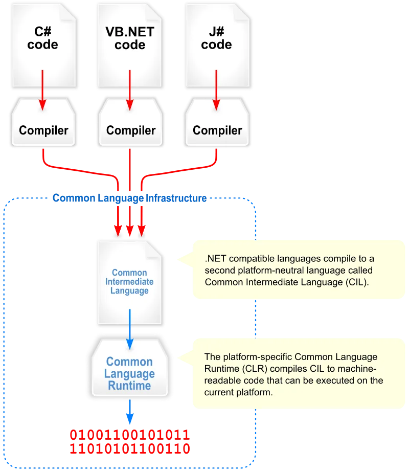

- 버전명칭
    - .NET Framwork > .NET Core > .NET 5.0 이상

### 절차적 프로그래밍 vs 객체지향 프로그래밍
- 절차적 : 순서대로 수행하도록 프로그래밍을 구현하는 것
- 객체지향 : 모든 것을 객체로 선언해서 메서드로 동작, 각 객체별로 메시지를 전달하는 형태로 프로그래밍을 구현하는 것

- 포괄적 의미 : 절차적 프로그래밍을 하면서 객체를 최대한 사용하는 방식

### C# 개발분야
- 윈도우 프로그램 : 윈 앱(Application -> App)
    - 아직 완벽하게 멀티플랫폼이 안됨
- 웹 앱 : ASP(Active Server Page).NET <--> Spring(Java Server Page)
    - MacOS, Linux, Windows 모두 가능
- 유니티 : 게임, 디지털트윈(산업체)
    - 크로스플랫폼(모바일까지)
- IoT 연동 : 아두이노, 라즈베리파이 가능

- C# 언어 난이도
    - C > C++ > Java > C# > Python

### C# 기본 구현
1. VIsual Studio 실행
2. C#이 없으면 추가 기능 설치
    - ASP.NET 및 웹 개발 선택
    - .NET 데스크톱 개발 선택
    - Unity 게임 개발 선택

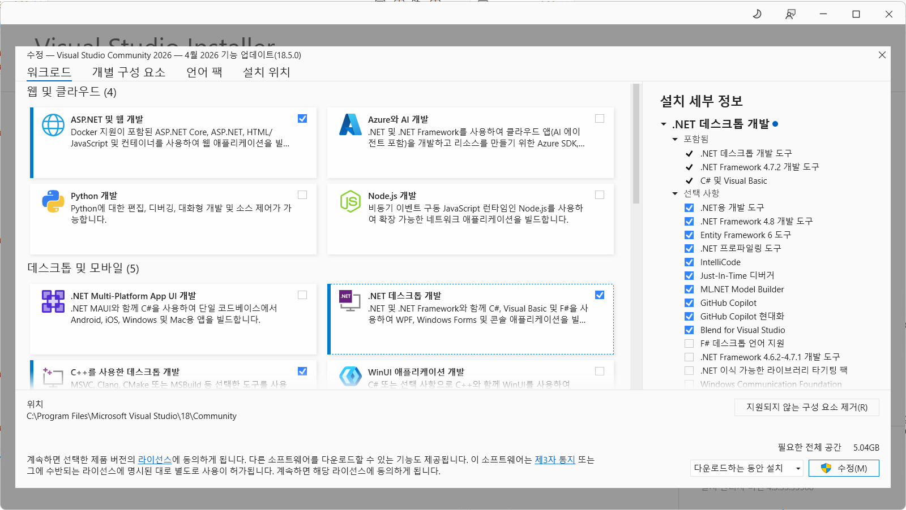

3. Visual Studio 재실행
4. 새 프로젝트 만들기
5. 언어 C#으로 선택
6. 콘솔 앱 선택
7. 새 프로젝트 구성 : 프로젝트 명, 저장 위치, 솔루션 이름 지정
8. 추가 정보 : 프레임워크 선택, 최상위 문 사용 안함 (Do not uses top-level statement) 체크X
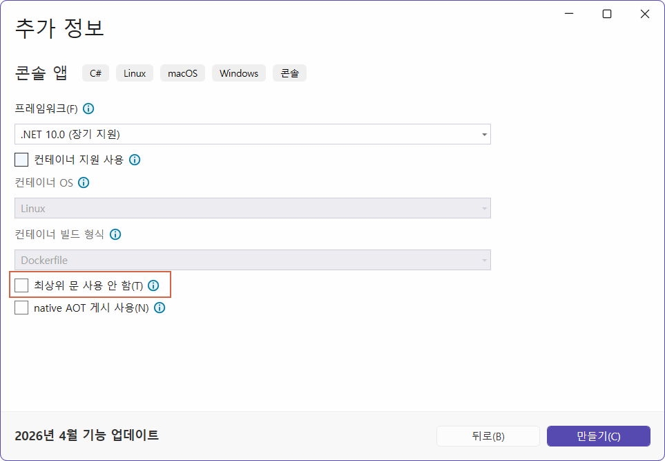
9. 만들기 버튼 클릭 - [소스](./basic/Ex01_basic/ConsoleApp1/Program.cs)
```cs
// 최신방식 - 처음 학습시에 도움이 안되는 방식
Console.WriteLine("Hello, World!");
```

10. 추가 정보에서 `최상위 문 사용 안 함`을 체크할 것

### C# 기본 문법

- 기본문법 - [소스](./basic/Ex01_basic/ConsoleApp2/Program.cs)

    ```cs
    using System;

    // C#은 네임스페이스 내 동작
    // Python에 import로 불러올 수 있는 패키지와 동일
    namespace ConsoleApp2 {
        // C# OOP. 모든 것은 객체
        internal class Program {
            // 기본 진입점(EntryPoint) 메서드(C#은 함수라고 부르지 않음)
            /// <summary>
            /// Main 메서드
            /// class와 메서드에서만 사용가능
            /// </summary>
            /// <param name="args">콘솔명령 옵션 파라미터</param>
            static void Main(string[] args)
            {
                // 빌트인 클래스 콘솔 내의 WriteLine 메서드로 콘솔에 문자열을 출력
                Console.WriteLine("Hello, C#!");
            }
        }
    }

    ```

- 주석 : 한 줄 주석(//), 여러줄 주석(/* */), XML주석(///)

- 변수와 타입 - [소스](./basic/Prac03Syntax/Prac03Syntax/Program.cs)
    - 초기화 : `접근제한자 타입 변수명`
    - 기본타입(구조체) : bool, sbyte, byte, short, unshort, int, uint, long, ulong, float, double, decimal, char, bool
    - 동일한 구조체 타입 : Bolean, Int16~128, Single, Double
    - 참조타입(클래스) : class, interface, array, string
        - 대문자로 시작하는 타입명
    - 변수 선언은 C와 동일
    - 형변환
        - 묵시적 형변환 : 작은 타입 변수를 큰 타입의 변수로 옮길때
        - 명시적 형변환 : `(타입)` 지정
    - var : 가변타입. javascript의 `var`, C++의 `auto`와 동일
    - 변수명 지정 시 class `AppleName`과 같이 사용 (java : `appleName`)

    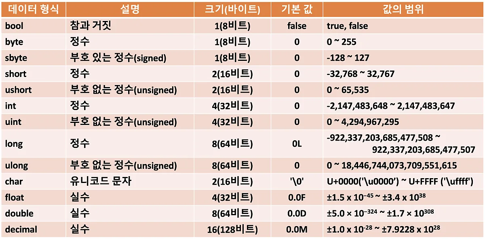

- 연산자
    - C/C++과 동일

- 제어문
    - if, switch, for, while 까지 C/C++ 동일
    - foreach는 컬렉션 이후

- 메서드
    - C/C++, Python 함수와 동일

- 객체지향
    - C++, Python 객체지향 클래스 내용과 동일
    - 클래스 : 명사와 동사의 집합
        - 명사 : 멤버변수, 속성(Property), Get or Set
        - 동사 : 멤버함수, 메서드(Method)
    
    ```cs
    class Person{
        public string Name;

        public void Eat(){
            console.WriteLine(Name + "이(가) 먹다.");
        }
    }

    static void main(){
        Person p1 = new Person();
        p1.Name = "길동";
        p1.Eat();
    }
    ```
    - 생성자 : 클래스명과 동일한 특수메서드
    - 오버로딩 지원 : 메서드 파라미터 갯수가 다르면 가능
    - 상속 : 동일하게 사용가능, 단일 클래스 상속 지원
        - 다중 인터페이스 구현으로 멀티클래스 상속 대체(Java, Python 동일)
    - 오버라이딩 가능 : 부모클래스의 메서드와 다르게 동작하는 메서드로 변경
    - this : 자기 클래스를 지칭할 때 

- 클래스 속성에서
    - get; : 속성의 값을 가져올 수 있음
    - set; : 속성의 값을 변경할 수 있음
    - get만 있으면 : 속성값 가져오기만 가능
    - set만 있으면 : 속성값 변경만 가능
    - get; set; : 둘 다 가능

- 컬렉션 - [소스](./basic/Ex01_basic/Prac04Collection/Program.cs)
    - 배열, 리스트 등 여러요소를 묶어서 사용하는 구조
    - ArrayList, List, Hashtable, Dictionary, Stach, Queue, Hashset, ...
    - 배열보다 컬렉션을 사용할 것
    > C같은 작은 범위에서만 사용, 일반적인 컴퓨터에선 사용하지 않는것을 추천

    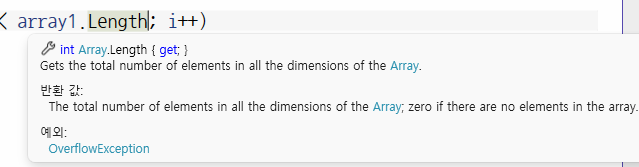

    - foreach : python, `for i in range(n)` 과 동일

- 예외처리
    - try ~ catch ~ finally 형식 사용 가능

### MSDN(MicroSoft Develper )
- https://learn.microsoft.com/ko-kr/dotnet/csharp/

### C# 프로그래밍

- C#으로 프로그램을 구현한다는 뜻
    - 윈도우 애플리케이션(WinApp), 웹앱(WebApp), Unity, 모바일(MAUI), 키오스크(WPF)등을 개발
    - GUI(Graphic User Interface) 활용

## 윈앱(WinApp)

- WinForms, Window Application, GUI... -> `WinApp`으로 통일
    - Windows Forms : 가장 오래된 윈앱개발 방식
    - WPF : 좀 더 최신의 윈앱 개발 방식

- 윈앱 개발에는 각 두개로 구분되어 있음
    - .NET Framework : .NET Framework 4.8 이전 구형 개발방식
    - 기본 : .NET 5.0 이상의 최신 개발방식

### 윈폼즈 앱 구현 순서

1. 새 프로젝트 - [위치](./winapp/DotNet02Test/)
2. 프로젝트명, 위치, 솔루션명 지정해서 다음
3. 프레임워크 .NET 10.0 선택 후 만들기
4. IDE 툴에서 펑션키 F4로 속성창 오픈
5. 보기 > 도구상자 (ctrl + alt + x)
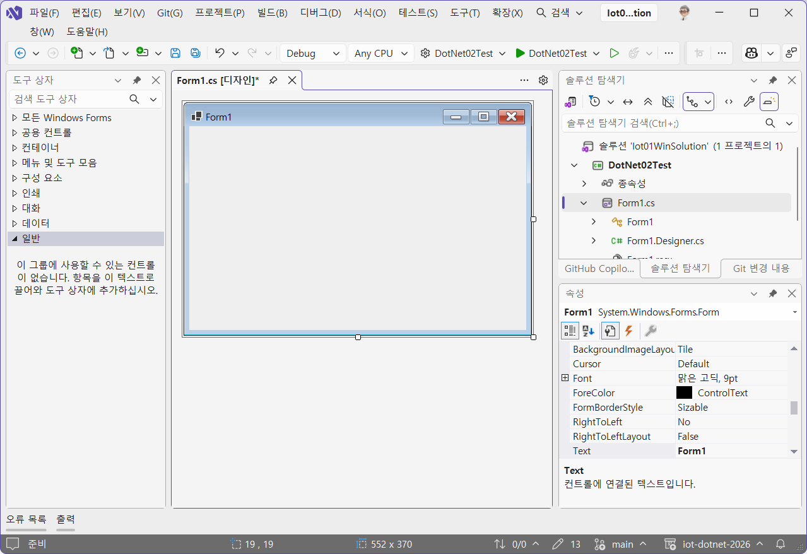

- partial이라는 기능을 통해 합침

7. 저장할때는 항상 ctrl + Shift + s(모두 저장)로 저장할 것
8. 도구상자의 컨트롤을 디자인 화면으로 드래그앤 드롭 하여 구성
9. 컨트롤의 속성 변경으로 디자인
10. 컨트롤의 이벤트 추가로 기능 구현
11. 디자이너 화면 `f7` <--> 비하인드코드 `shift + f7`
12. `ctrl + space`, `alt + enter` VS(VS COde 포함)에가 가장 많이쓰는 단축키

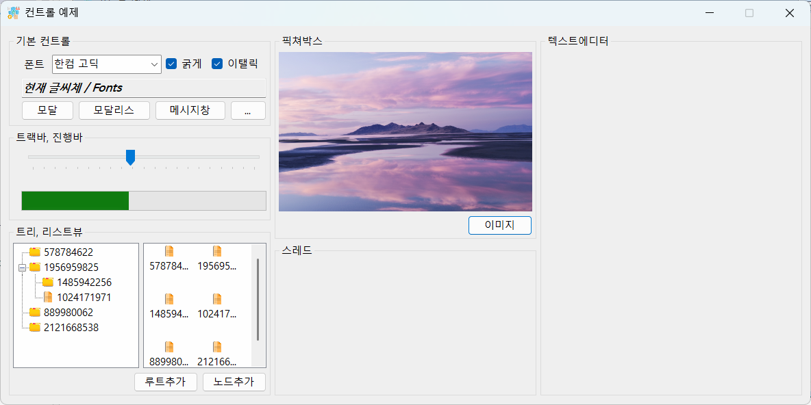

### 트러블 슈팅
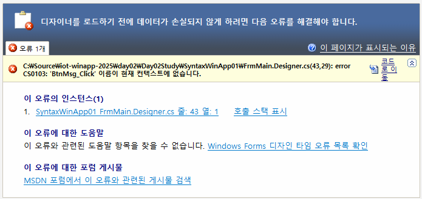

- Visual Studio 2022이상에서 윈폼즈 개발시 디자인화면에서 버튼을 더블클릭 이벤트 추가할 경우 발생하는 오류
- Designer.cs에 생성된 이벤트 선언문과 .cs파일에 이벤트핸들러가 생성되지 않아서 발생

#### 첫번째 방법
1. Designer.cs내 `Windows Form Designer generated code` 영역을 확장
2. 빨간색 밑줄이 그인 오류 이벤트 이름 삭제
3. VS 재시작

#### 두번째 방법
1. Designer.cs내 `Windows Form Designer generated code` 영역을 확장
2. 빨간색 밑줄이 그인 오류 이벤트에서 `Alt+Enter`
3. 메서드 생성
4. .cs로 메서드 이전

### 윈폼즈앱 용어
- 모달/모달리스 : 부모창과 자식창의 관계
    - 모달(Modal) : 서브(모달)창 종려 전에는 부모창 제어 불가
    - 모달리스(Modaless) : 서브창 종료와 관계없이 부모창 제어 가능
    
- 속성 변경방법
    - 디자인타임 변경 : [디자인] 작업 시 속성창의 송성값 변경
    - 런타임 변경 : 비하인드 코드 내에서 속성값을 변경, 실행 시 변경되는 것

### 스레드 사용
- 윈앱 자체가 UI 스레드를 사용
- 반복작업을 스레드없이 수행하면 UI 스레드와 충돌발생 - (응답 없음)
- C#에서 스레드 사용방법
    - 스레드 클래스 사용 - 개발자 코딩 필요
    - 백그라운드워커 클래스 사용 - 필수요소만 처리
    > 백그라운드 워커가 훨씬 쉬움

- 백그라운드워커 구현법
    1. 워커_DoWork - 첫 실행하는 부분
    2. 워커_ProgressChanged - 진행사항 UI 스레드로 전달
    3. 워커_RunWorkerComplete - 스레드 완료 후 처리할 것들 구현

- async/await 키워드로 진행
    - 비동기 처리를 지원하는 메서드만 사용가능

### 윈앱 기본컨트롤 예제앱

- 라벨, 콤보박스, 체크박스, 텍스트박스(멀티, 싱글라인), 버튼
- 메시지박스, 다이얼로그
- 트랙바, 진행바
- 트리뷰, 리스트뷰, 이미지리스트, 픽쳐박스
- 백그라운드워커(스레드)
- 리치텍스트박스
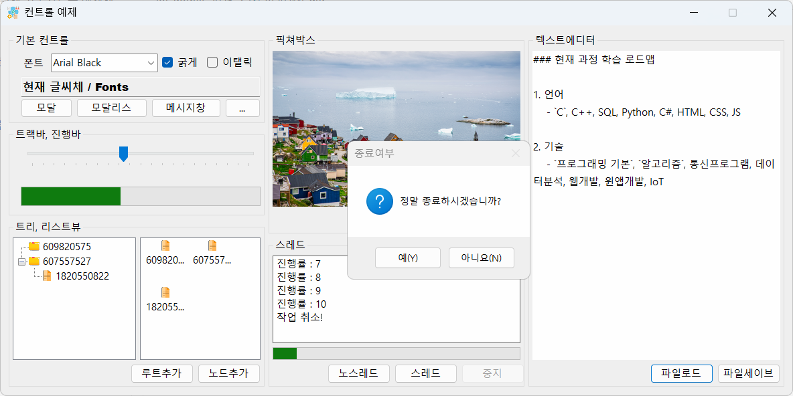

### 비동기 처리 앱
- 비동기로 호출할 메서드 앞에 await 키워드 추가
- 비동기 메서드를 호출하는 부모메서드 접근제어키워드와 리턴값 사이에 async 키워드 추가
- 일반 메서드를 비동기 메서드로 변경 (일반 메서드 뒤에 async 포함)
- 리턴값이 있을 때 변경 long -> Task<long>
- 아주 간단하게 스레드 처리가능

- 동기화 복사는 복사 기능 도중, 다른 이벤트 사용불가
- 비동기화는 사용 가능

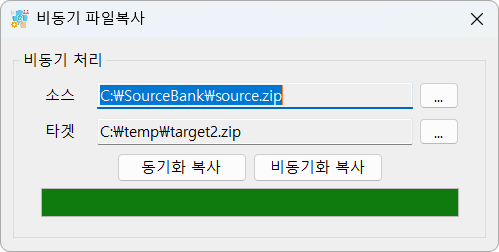

### DB연동 앱
- MySQL bookrentalshop 연동

#### 외부 라이브러리 활용
- 윈폼즈 앱 개발시 직접 디자인 매우 어려움
- 3rd 파이사에서 여러 라이브러리를 제공
- 예전에는 따로 설치, 내 프로젝트에 붙여넣기
- NuGet Pakage 존재 - Python pip와 동일한 기능

#### NuGet 설치 순서
1. 프로젝트 우클릭 > NuGet 패키지관리 클릭
2. 찾아보기에서 필요한 라이브러리 검색
3. 패키지 세부사항 > 종속성 현재 프로젝트 버전과 일치
4. 설치 클릭, 번경내용 미리보기 확인
5. 라이선스 허용여부 다이얼로그가 뜬다면, 허용

#### DB 연동 구현
1. NuGet 패키지 MySQLConnector 설치
2. DatabaseHelper 클래스 생성. 작성
- SelectBooks 메서드 작성 - [소스](./winapp/Iot02WinSolution/DotNet06DbBooksApp/DatabaseHelper.cs)
3. DataGridView, Button 컨트롤 추가
4. 버튼 클릭이벤트에 메서드 추가

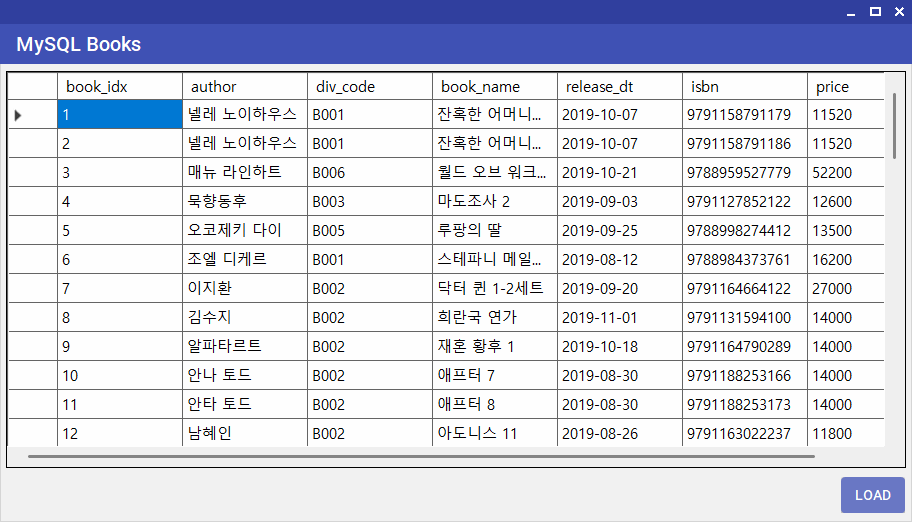

#### DB연동 앱 - 데이터 추가, 수정, 삭제

- INSERT, UPDATE, DELETE 기능 구현

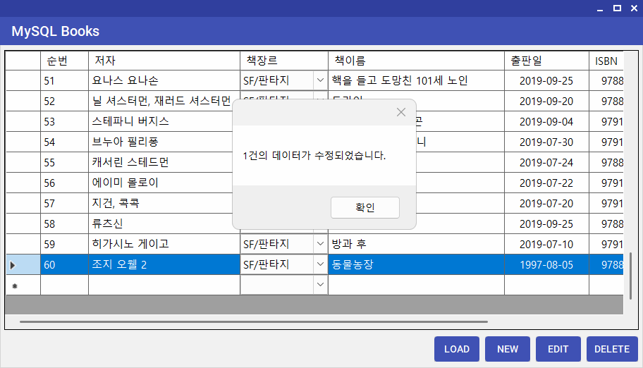

#### C# 개발 Tip
- C# 문법 중 새 겍체 생성할 때 초기화 방법
    ```cs
    // 전통적인 속성 할당
    // book_idx 
    DataGridViewTextBoxColumn colBookIdx = new DataGridViewTextBoxColumn();
    colBookIdx.Name = "book_idx";
    colBookIdx.HeaderText = "순번"; // 화면표시 컬럼명
    colBookIdx.DataPropertyName = "book_idx";
    colBookIdx.ReadOnly = true;  // PK는 수정하면 안됨!!
    ```

    ```cs
    // book_idx
    DataGridViewTextBoxColumn colBookIdx = new DataGridViewTextBoxColumn
    {
        Name = "book_idx",
        HeaderText = "순번", // 화면표시 컬럼명
        DataPropertyName = "book_idx",
        ReadOnly = true  // PK는 수정하면 안됨!!
    };
    ```

## 웹앱

### 서버 클라이언트

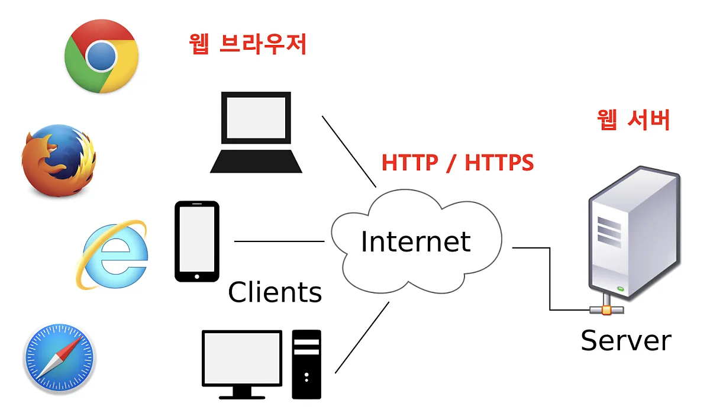

### 웹 서비스

- 웹 서버와 API 서비스 모두 통칭해서 웹서비스라고 칭함
- API 서버 - 데이터만 전달하는 형태의 웹 서비스
    - 공공 데이터 포털, 네이버API, 구글API

### 일반 웹서버
- HTML, CSS, Js 사용 웹화면 개발 + 백엔드
- ASP.NET, Spring Boot 등을 사용하여 기본적인 웹서버 개발
- 네이버, 구글, 기업 홈페이지....

### ASP.NET
1. 새 프로젝트 - ASP.NET Core 웹앱(MVC) 선택
2. 프로젝트명, 위치, 솔루션명 입력 다음
3. 프레임워크 선택, 인증 유형 없음, HTTPS 체크, 최상위문 사용안함 체크
4. 나머지는 기존 상태 그대로 만들기

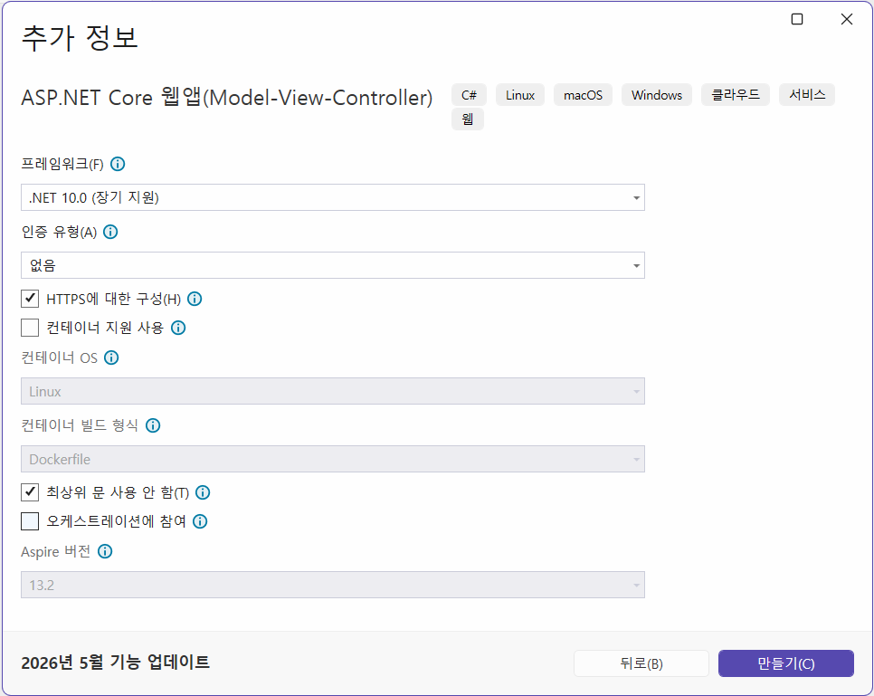

### ASP.NET API서버
1. 새 프로젝트 - ASP.NET Core 웹 API
2. 위와 동일
3. OpenAPI, 컨트롤러 사용 체크 나머지 동일
4. 서버 실행
    - Get으로 데이터 조회 https://localhost:`portnum`/weatherforecast/
    - 서버 상태 확인 https://localhost:`portnum`/openapi/v1.json

    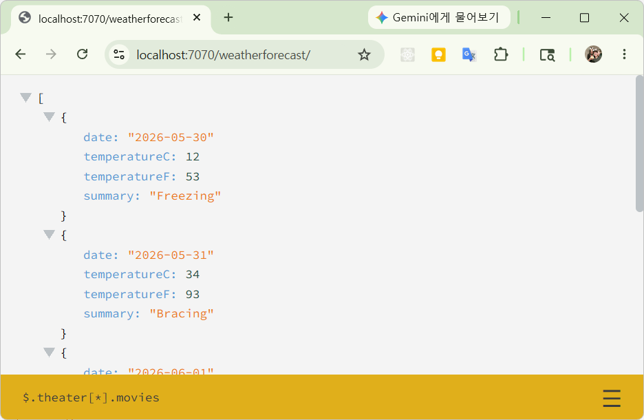

### http 메서드
- GET - Select와 동일, 조회
- POST - Insert와 동일, 등록 위주, 수정 및 삭제도 가능
- PUT - Update와 동일
- DELETE - Delete와 동일, 삭제

## 유니티

- 게임엔진 : Unity(C#), Unreal(C++), Blender(Python), Godot Engine(C#)
- Unity 특장점
    - 구현 난이도 낮음, 툴 실행이 빠름
    - 인더스트리 분야 진입 속도가 빠름
    - 캐주얼 게임, 디지털 트윈(현실세계와 가상세계를 일치화)

### 유니티 설치

- 유니티 공식 사이트 - https://cloud.unity.com/
- 회원가입 로그인 후 다운로드
- 유니티 허브 실행 > 로그인
- Install > Editor 설치

### 유니티 프로젝트 생성

- 유니티 허브
- 3D (Built-in Render Pipeline)선택
- Project name 입력, Location 확인
- Create Project 클릭
- Unity Editor 팝업

### 씬 에디터 키보드/마우스 동작
- 키보드 방향키
    - 좌우 : 화면 이동
    - 위아래 : 줌인/아웃
- Shift : 방향이동 가속
- 마우스
    - 왼쪽 버튼 : 오브젝트 선택
    - 오른쪽 버튼 : 시점 변환
    - 스크롤 : 줌인/아웃
    - 스크롤 버튼 : 시점 이동

### Unity 구현 순서
- 오브젝트 생성
    - 바닥 Plane, Cube변형
    - 배경 오브젝트
    - 캐릭터 오브젝트
- 씬 내 카메라, 라이트 설정
- 오브젝트 위치, 회전, 스케일 조정
- 머터리얼 사용, 텍스쳐 적용
- 애니메이터로 애니메이션 적용
- 스크립트 생성
- 오브젝트 스크립트 할당
- 충돌 감지(Collider) 적용

### 유니티

- 3D 모델 Import 적용법
- 프리팹 사용
- 애니메이터 사용
- C# 스크립트 사용법

### 유니티 디지털트윈

## WPF
- 

### OpenAPI연동 앱
- 미세먼지 모니터링앱
- 국가교통정보 CCTV뷰 앱
- IoT 모니터링앱

### 키오스크 앱
- 결제이전까지 동작하는 버전
- WPF를 사용해서 구현

### 라이브러리 만들기
