# 2026 닷넷 개발자 데스크톱 개발

## 1. WPF 실습

### 1.1 카페 키오스크 개발

- 사용 스펙
  - WPF (.NET 10.0)
  - MaterialDesign (MaterialDesignInXamlToolKit)
  - MySQL + DBeaver

#### 프로젝트 생성

- WpfCafeKiosk
- NuGet Package, MaterialDesignThemes, MySQLConnector 설치
- MahApps.Metro.IconPacks 추가 설치
  

#### 프로젝트 구성

- WPF 머터리얼디자인 적용
- 키오스크 UI 제작
- 메뉴 모델, 주문 모델 생성
- 메뉴버튼 하드코딩
- MySQL menu 테이블 생성
- DB에서 메뉴 조회
- 메뉴버튼 동적생성
- 주문목록, 총액 계산

#### MaterialDesign 적용

- App.xaml에 리소스딕셔너리 적용

#### MySQL DB, Table 생성

- cafekiosk 데이터베이스 생성
- menu 테이블 생성

```sql
CREATE TABLE orders
(
    order_id INT PRIMARY KEY AUTO_INCREMENT,
    order_date DATETIME NOT NULL DEFAULT CURRENT_TIMESTAMP,
    total_count INT NOT NULL,
    total_amount INT NOT NULL
);

CREATE TABLE order_detail
(
    detail_id INT PRIMARY KEY AUTO_INCREMENT,
    order_id INT NOT NULL,
    menu_id INT NOT NULL,
    menu_name VARCHAR(100) NOT NULL,
    price INT NOT NULL,
    count INT NOT NULL,
    total_price INT NOT NULL,

    CONSTRAINT fk_order_detail_orders
        FOREIGN KEY (order_id)
        REFERENCES orders(order_id)
);
```

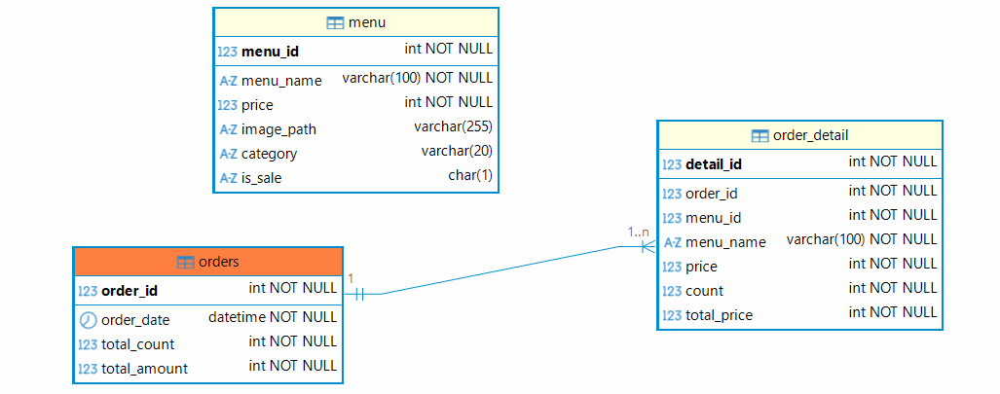

#### 모델 클래스

MenuItem - DB menu테이블과 매핑

OrderItem - 주문리스트 저장

#### 이미지 작업

- pixabay등 사이트에서 다운로드
- 일부편집
- Image 폴더
  


#### 메뉴 옵션 팝업창 작업


#### 기본 동작 이벤트 구현

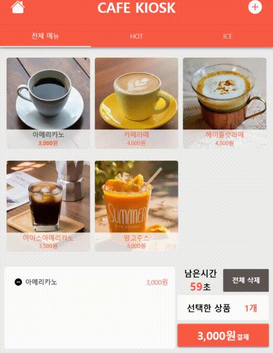

### 카페 키오스크 구현 리스트

- [X] 옵션 팝업창에서 수량 선택한 내용 주문담기 버튼 기능구현
- [X] 키오스크 리스트뷰 음료 리스트업
- [X] 선택한 상품, 결제 버튼 비용, 갯수연동
- [X] 전체 삭제 기능
- [X] 남은 시간 완료 후 전체내용 초기화
- [X] 홈 버튼 클릭 초기화
- [X] 메인창에서 옵션창으로 MenuId 전달
- [ ] DB연동!! 메뉴 SELECT / 주문내역 INSERT
- [X] 메뉴 동적 바인딩!!
- [ ] DB저장 후 신용카드 결제 팝업(더미)

#### 옵션창 주문내역 확인


- `Tag={Binding}` - 객체 자체의미, OrderItem 객체 자체. 하위에서 MenuName, Count 등 사용 가능
- Margin, Padding 위치 순서 - Left, Top, Right, Bottom / Left&Right, Top&Bottom 순
- Conner Radius 위치 순서 - TopLeft, TopRight, BottomRight, BottomLeft / TopLeft&BottomRight, TopRightBottomLeft 순

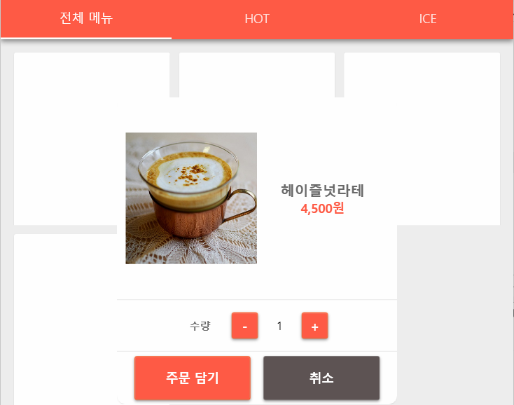

### 실행결과
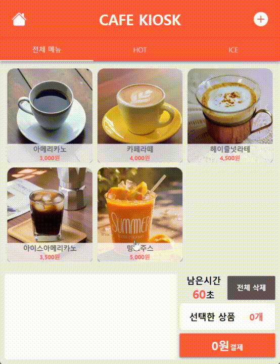

#### 로그확인 방법
- 프로젝트속성 > 출력 유형
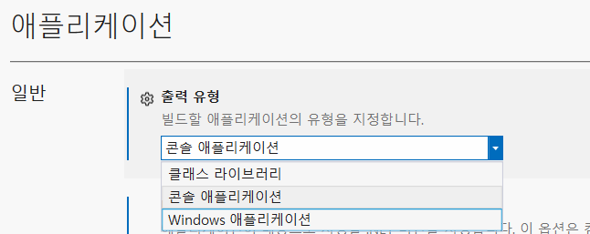

- windows 애플리케이션 -> 콘솔 애플리케이션 변경
- MessageBox.Show() 대신 Console.WriteLine()으로 메서드 변경

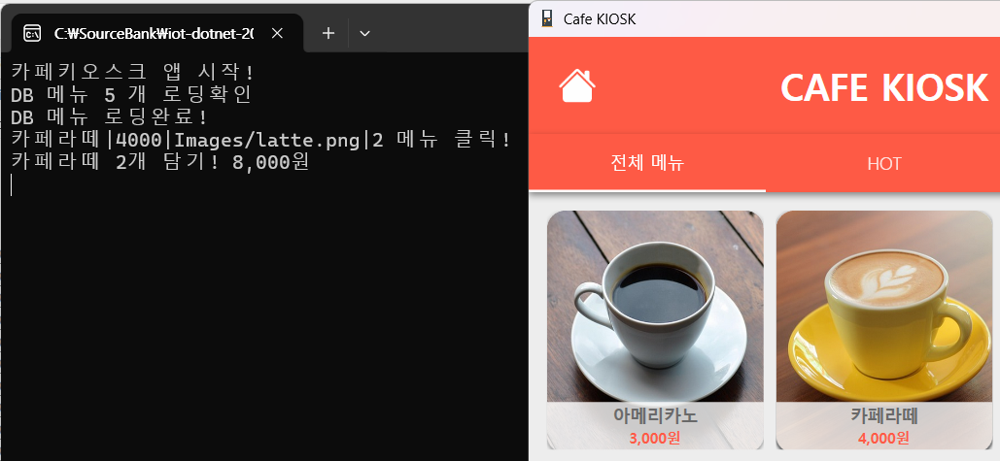

#### DB 주문내역 등록
- DatabaseHelper에 INSERT 처리 메서드 추가
- MainWindow.xaml.cs에 저장쿼리 실행 메서드 추가
- BtnPay_Click 이벤트핸들러에 저장 메서드 추가

#### 최종 작업
- 프로젝트 속성 > 출력 유형, Windows Application으로 변경
- 구성관리자 Debug > Release로 변경 빌드
- 배포...

#### 전체 실행결과
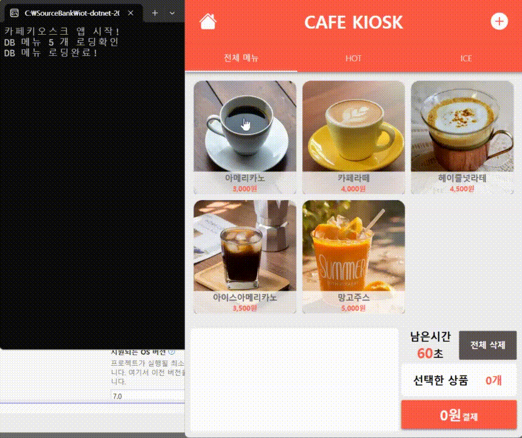

---

### 1.2 OpenAPI 연동앱 개발

#### OpenAPI 개요
- 웹 서비스 종류
  - 웹 사이트 - 디자인이 적용된 프론트엔드와 데이터를 핸들링하는 백엔드를 전부 서비스
  - OpenAPI(RestAPI) - 프론트엔드 없이 데이터만 제공하는 서비스
- OpenAPI 활용처
  - 모바일 앱 - 버스도착 앱, 날씨조회 앱, 영화검색 앱...
  - IoT 데이터 연동 - 데이터 전달 인터페이스
  - SNS 연동
  - 결제시스템
- [공공데이터 포털](https://www.data.go.kr/)
  - 국가 공공데이터 사용 창구
  - 회원가입 후, 개인 API인증키 발급
  - 데이터 찾기, 활용신청

#### 공공데이터 사용법
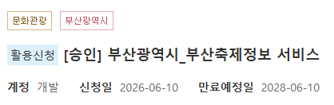
- 참고문서 확인 - json을 서비스 지원 확인

- URL 사용할 일반인증키(Encoding)를 ServiceKey에 사용


- 서비스 URL 구조
  - 기본 URL - https://apis.data.go.kr/6260000/FestivalService/getFestivalKr
  - Get Method URL - 원하는 서비스를 요청하는 URL값, key=value쌍, 시작은 ?, 구분자는 `&`
    - ?serviceKey=서비스키 - 데이터포털에서 할당받은 서비스키
    - &pageNo=1 - 요청할 페이지 번호
    - &numOfRows=10 - 한페이지당 데이터 수
    - &resultType=json - 결과타입(xml, json)
  - json 타입 데이터 - WPF앱에서 핸들링
    - DB데이터 연동방법과 유사

#### 부산축제 정보 앱

- 공공데이터 포털 > 부산 축제정보 서비스 신청
- WPF앱
  - Newtonsoft.Json
  - MahApps.Metro
  - MahApps.Metro.IconPacks
  - CefSharp.Wpf.NETCore - 웹브라우저 패키지(구글맵 표현)
  - NLog - 로그 작성 패키지

- UI디자인
- 서비스 클래스, 데이터 모델 클래스

- 구성
  - WpfBusanFestivalApp
    - Models
      - 관련 클래스
    - Servies
      - 관련 클래스
    - MainWindow.xaml
    - MapWindow.xaml

- 구성관리자 플랫폼
  - Any CPU - 현재 OS를 확인해서 알맞은 플랫폼을 선택
  - ARM - 임베디드 저전력장치 CPU 아키텍처. Advanced RISC Machines 약자
    - ARM32 - 32비트(Integer 표현크기) ARM CPU. 구형 CPU
    - ARM64 - 64비트 ARM CPU
  - AMD - ARM과 비교하기위해 사용하는 OS 아키텍처. Intel CPU와 동일한 의미
    - x86 - 32비트
    - `x64` - 64비트. 현재 윈도우의 기본
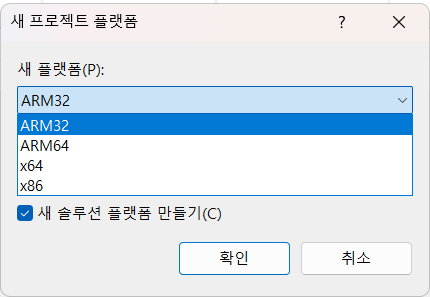

#### JSON
- JavaScript Object Notation 약자
  - 자바스크립트에서 데이터를 표현하는 방법으로 만든 표준
  - 아래의 문법형태로 데이터를 네트워크로 전달
  - 중괄호로 데이터 범위 지정, 키는 문자열, 데이터는 숫자, 문자열, 불린 등, `:` 으로 구분

  ```json
  {
    "제목" : "부산불꽃축제",
    "날짜" : "2026-10-08",
    "장소" : "부산광역시",
    "입장료" : 5000,
    "진행여부" : true,
    "리스트" : [1, 2, 3, 4, ...],
    "이미지" : "x09xFF...",
    {
      // 하위 데이터
    }
  }
  ```
  - JSON 텍스트 <--> 클래스 객체 변환 : Newtonsoft.json 패키지 사용

#### ChatGPT 사용 UI 요청
- WPF MAhApps.Metro UI 요청 프롬프트
  ```
  WPF로 업로드한 그림과 동일한 구조로 xaml 파일을 만들어줘.
  MahApps.Metro 패키지 사용중이고 부산 축제정보 앱을 만들거야
  ```
  - AI가 생성한 리소스 디자인 사용 불가. MahApps.Metro 사용
  - NumericUpdown 컨트롤 prefix(mah:) 추가 필요

#### 데이터포털 서비스키 설정
- 설정 방법
  1. 제공키 일반 복사로 공개
  2. 암호화로 저장. 복호화 사용
  3. 윈도우 환경변수 저장, setx 명령어 사용
  4. 닷넷 User Secrets 기능 사용, dotnet user-secrets set ~~

- 윈도우 환경변수 등록

  ```powershell
  # 등록
  > setx BUSAN_FESTIVAL_API_KEY "발급받은키"
  setx BUSAN_FESTIVAL_API_KEY "9b63e0bdd16bfd90e5bc90789b0327a9668e7b366abb8e9e0fd9c665b0235e4f"
  # 콘솔 재시작 후 확인
  > $env:BUSAN_FESTIVAL_API_KEY
  발급받은키
  ```
  - 레지스트리편집기에서 등록한 서비스키 확인
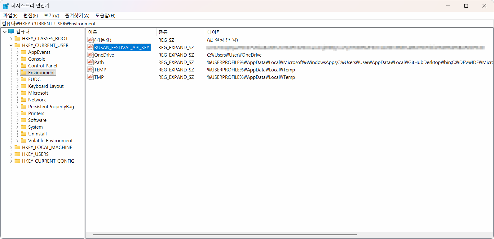

- 닷넷 User Secret - 프로젝트 위치에서 실행
  ```powershell
  // 초기화
  > dotnet user-secrets init
  // 등록
  > dotnet user-secrets set "FestivalApiKey" "발급받은키"
  > dotnet user-secrets set "FestivalApiKey" "9b63e0bdd16bfd90e5bc90789b0327a9668e7b366abb8e9e0fd9c665b0235e4f"
  ```

#### 중간 실행결과
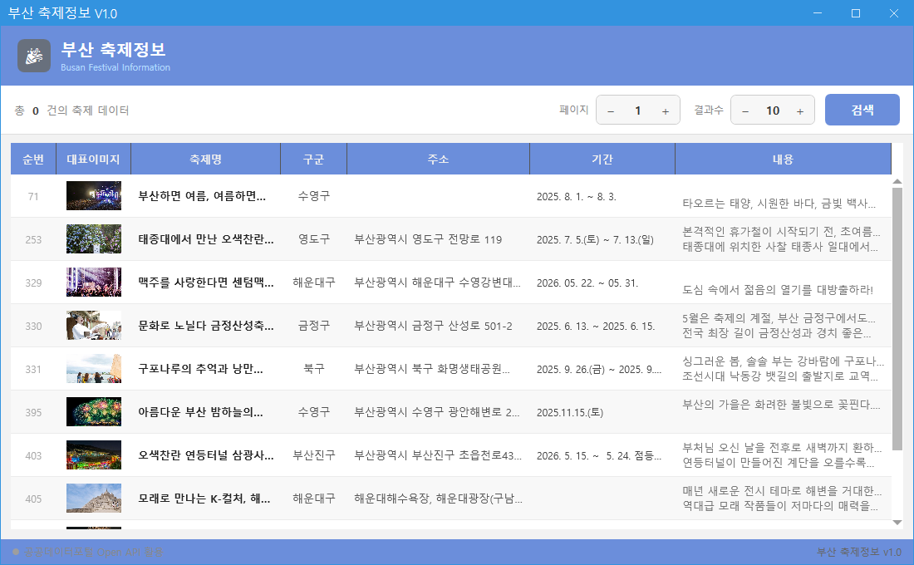

#### 추가 작업

- [ ] NLog로 로그처리
- [ ] MahApps.Metro.IconPacks 사용
- [ ] 비동기 메서드 수정
- [ ] 페이지번호, 결과수 파라미터 사용하기
- [ ] 검색버튼 기능
- [ ] 데이터그리드 포커스 색상 반전
- [ ] 데이터그리드 레코드 클릭시 상세 팝업
- [ ] 데이터그리드 레코드 더블클릭시 지도 팝업
- [ ] 기타 예외처리

### SmartHome 솔루션

## 2. Unity 실습