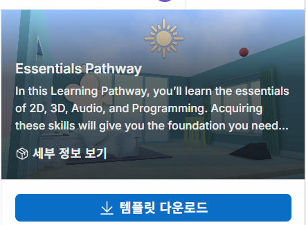

# 2026 닷넷 개발자 데스크톱 개발

## 2. Unity 실습

### 2.1 유니티 학습

- https://learn.unity.com/ 튜토리얼대로 하기
- keijiro Takahashi Github : https://github.com/keijiro
- 이전버전 확인 다우로드 설치

#### GetStarted With Unity

- Tutorial 순서대로 따라하기

- 1번 챕터 완료후

### 2.2 Essentials PathWay

- 가장 짧은 시간에 Unity를 학습할 수 있는 튜토리얼

### 2.3 Unity Factory 