# 2026 닷넷 개발자 데스크톱 개발

## 2. Unity 실습

### 2.1 유니티 학습

- https://learn.unity.com/ 튜토리얼대로 하기
- keijiro Takahashi Github : https://github.com/keijiro
- 이전버전 확인 다우로드 설치

#### GetStarted With Unity

- Tutorial 순서대로 따라하기


- 1번 챕터 완료후


### 2.2 Essentials PathWay

- 가장 짧은 시간에 Unity를 학습할 수 있는 튜토리얼

#### Essentials PathWay Template


- 템플릿 다운로드 우선
- 프로젝트명, 프로젝트 위치 선택, 생성

#### 화면/시점 이동

- 방향키, wasd
- Mouse Right, Wheel
- Fly Mode : Mouse Right + wasd / EQ

- Object 선택 후 F 클릭

#### Pan Tool

- 오브젝트 위치, 회전, 크기를 조절할 수 있는 아이콘 툴바

- Veiw 

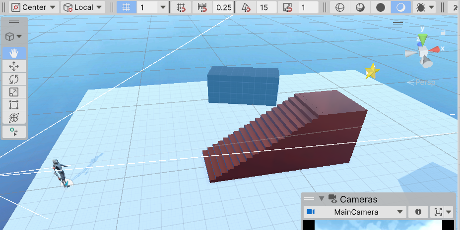
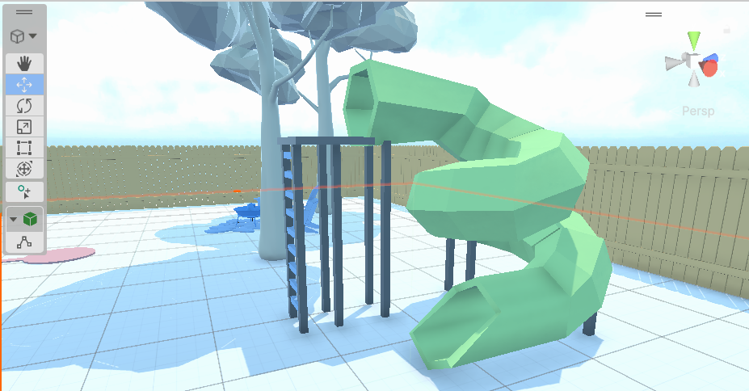 

#### Kid's Room 꾸미기

- 방 오브젝트
- 침대, 카펫, 협탁, 알람시계, 침실조명 등 위치 및 회전, 크기조정


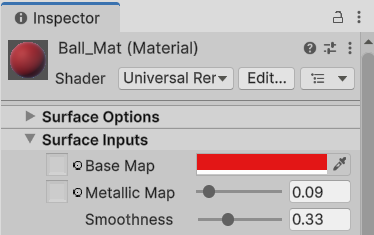
- Material 객체를 Ball 객체에 드래그\

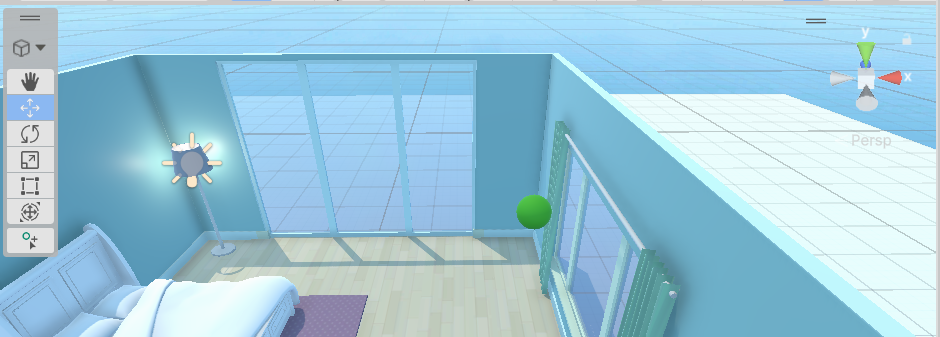

#### RigidBody

- 물리역학 기능 제공 컴포넌트
- Ball 선택 Inspector에서 Add Component 버튼 클릭

#### Physics Material

- 물체가 충돌할 때 마찰력, 반발력을 설정하는 자산
- Bounciness : 1 완전 탄성 충돌
    - 0.1(쇠구슬), 0.7(축구공), 0.9(고무공)

#### Ramp Object 추가

- 위치, 회전 지정
- Mesh Collider 컴포넌트 추가


#### Block 객체 생성

- Cube로 생성
- Scale x,y,z를 0.1, 0.25, 0.1로 설정. Ball이 튕겨서 닿는 위치에
- Rigid Body 추가

#### 카메라 시전 변환

- Flythrough 모드로 이동후
- 카메라 오브젝트 선택
- Ctrl + Shift + f : 현 카메라 시점을 플레이 카메라 시점으로 변경

#### 프리팹 변경

- Prefabs 폴더 내에 기존 Object를 드래그하면 Prefab으로 변경


#### Block 쌓기

- Pivot을 Center로 변경 후 
- 프리팹 Block을 쌓아올림

#### 프리팹 편집모드


- 프로젝트 창의 프리팹을 더블클릭
- Inspector 수정
- RigidBody > mass를 1보다 작게 수정(0.1)
- mass가 
- Hierachy 창의 < 버튼 클릭

#### 라이트, 스카이박스 조정

- 라이트
    - y,z 축으로 낮밤 조절 가능
    - Emission > Color 조정으로 빛 색상 조절
    - Emission > Light Appearance, Filter and Temprature 선택후 
    - 빛의 온도와 느낌을 조정
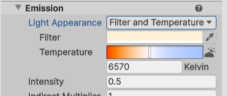
- 


#### 플레이ㅏ모드 구분 짓기
- Preferences > Colors > Play mode tints 색상을 어두운색으로 변경
- Play시 UI 색상이 Edit모드와 다르게 표시


#### 피벗기능

- Object를 쌓을때 v를 누르면 Object의 기준점이 변경


### Chapter2
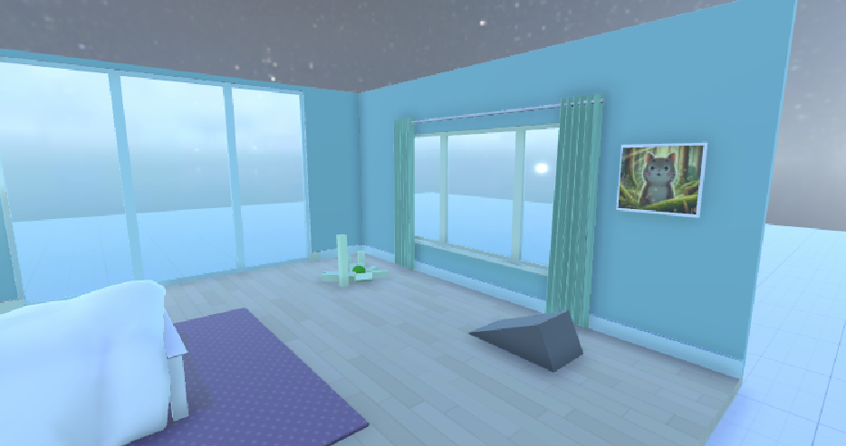

#### Chapter3 

- 냄비 프리팹 선택. 가스레인지 위 위치
- Audio Source 컴포넌트 추가
- Audio Generator 선택, Loop 체크
- Spatial Blend : 2D ~ 3D로 변경

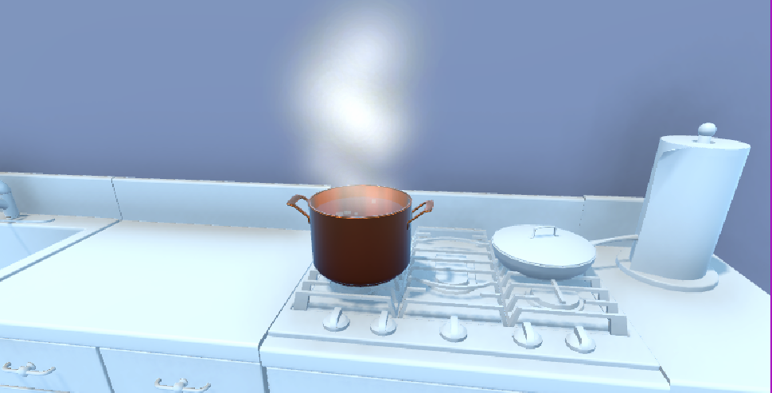


#### Unity 오브젝트 복사

- Ctrl + D : 선택한 오브젝트가 바로 복사

#### 단축키
- 메뉴 Edit > Shorcuts


#### 배경음악, 새소리
- 계층창에서  Audio Source 선택
- 알맞은 사운드 Audio Generator에 선택
- 시작하면서 바로 음악 플레이 하고 싶으면
    - Play on Awake 체크
- 새소리처럼 랜덤하게 플레이 하고 싶으면
    - Play on Awake 체크해제
    - PlaySoundAtRandomIntervals 스크립트 추가
    - Min/Max Seconds 랜덤시간 지정

#### Chapter 4. Programming

- 유니티 개발시 가장 핵심!

- Player 오브젝트 위치, 회전, 크기 조정
- PlayerController 스크립트 생성, Player 드래그

- 입력시스템 변경
    - Project Settings > Player > Other Settings > Input Handing, both로 바꾸기

#### 카메라 플레이어 Child 지정

- Main Camera, Player 하위로 드래그
- 카메라 위치 수정 및 드래그

- 방 아래 Cube까지 화면에 출력. 위치 조정 잘 해줘야 플레이시 카메라 진동X

#### 플레이모드 변수값 변경

- Speed : 5.0f, RotationSpeed : 120.0f
- 플레이시 이동속도가 빠름
- 플레이모드 변수값 수정하면서 알맞은 속도 확인
- 

#### 아이템 코인 오브젝트
- Prefabs 폴더에서 Collectible Coin 드래그, 위치, 사이즈 조정
- Collectable.cs 스크립트 생성

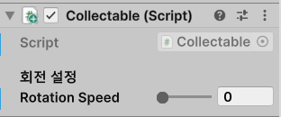

#### 아이템 획득 기능 추가

- Coin에 Box Colider > `Is Trigger` 체크
- 충돌은 발생하지 않고, 충돌감지 기능 활성화

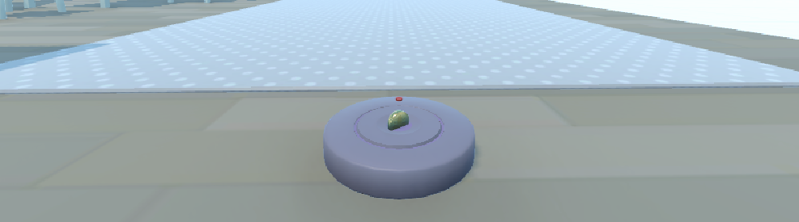

```cs
public class Collectable : MonoBehaviour {
    [Header("회전 설정")]
    [Tooltip("프레임당 회전 속도")]
    public float rotationSpeed = 1.0f;

    [Tooltip("아이템 획득시 이펙트지정")]
    public GameObject OnCollectEffact;

    void Start()
    {
    }

    // Update is called once per frame
    void Update()
    {
        transform.Rotate(0, rotationSpeed, 0);  // 매프레임마다 y축을 rotationSpeed씩 회전
    }

    // 물체끼리 충돌이 발생했을때 이벤트처리
    private void OnTriggerEnter(Collider other)
    {
        // Destroy the collectable 
        Destroy(gameObject);

        Instantiate(OnCollectEffact, transform.position, transform.rotation);
    }
}
```

#### 점프기능 추가

- PlayerController.cs에 공용변수, Update() 추가

```cs
[Tooltip("점프강도")]
public float jumpForce = 3.0f;

private void Start()
{
    rb = GetComponent<Rigidbody>();
    if (rb == null) Debug.LogWarning("PlayerController needs a Rigidbody.");
}

// 입력처리, 카메라... Frame별 실행
// LateUpdate() : Update() 후에 실행되는 메서드. 카메라 추적
private void Update()
{
    if (Keyboard.current.spaceKey.wasPressedThisFrame)
    {
        rb.AddForce(Vector3.up * jumpForce, ForceMode.VelocityChange);
    }
}
```
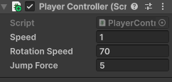

#### 생성형 AI 활용 밤낮처리 추가

- 프롬프트
```
유니티에서 Directional Light를 조정해서 밤낮으로 바뀌는 스크립트를 작성해줘. 
20초에 한번씩 해가지고 다시 뜨도록 만들어줘. 
DayNightCycle.cs로 만들어줘
```

- Directional Light 오브젝트에 할당
- 변수 Sun Directional Light 할당

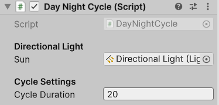

- Tutorial 스크립트

```cs
using UnityEngine;

public class DayNightCycle : MonoBehaviour
{
    [Header("회전 속도 설정")]
    public float rotationSpeed = 1f;

    [Header("시간 설정")]
    [Tooltip("하루(24시간)가 지나는데 걸리는 실제 시간(초)")]
    public float dayDuration = 60f;

    private float timePassed = 0.0f;

    void Start()
    {
        rotationSpeed = Mathf.Abs(rotationSpeed);
    }

    void Update()
    {
        float angleToRotate =
            (360.0f / dayDuration) * Time.deltaTime;

        transform.Rotate(
            Vector3.right,
            angleToRotate * rotationSpeed);

        timePassed += Time.deltaTime;

        if (timePassed >= dayDuration)
        {
            timePassed = 0.0f;
        }
    }
}
```

#### 방문열기 기능

- DoorOpener.cs 생성
- Door 루트오브젝트에 스크립트 지정
- Box Colloder 추가 후 위치, 크기 수정
- 튜토리얼에 있는 스크립트 붙여넣기
- Player 객체에 `Player` 태그를 선택

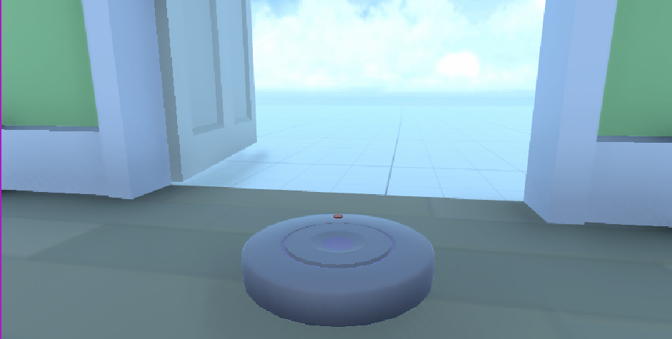

#### 코인 획득 사운드 추가
```cs

private void OnTriggerEnter(Collider other)
{
    if (other.CompareTag("Player"))
    {
        AudioSource.PlayClipAtPoint(pickupSound, transform.position);   // 뾰롱소리
        Destroy(gameObject);     // 코인삭제
        Instantiate(OnCollectEffact, transform.position, transform.rotation);   // 파티클 이펙트 실행
    }
}
```

- 프리팹의 코인을 선택, Script 내 pickupSound 설정


#### Chapter 6. 배포하기

- UI(Canva) 메뉴에서 선택

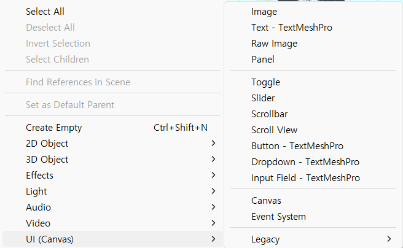

#### 빌드 시 사용할 신 리스트 설정

- 메뉴 File > Build profile 선택
- seenlist 추가

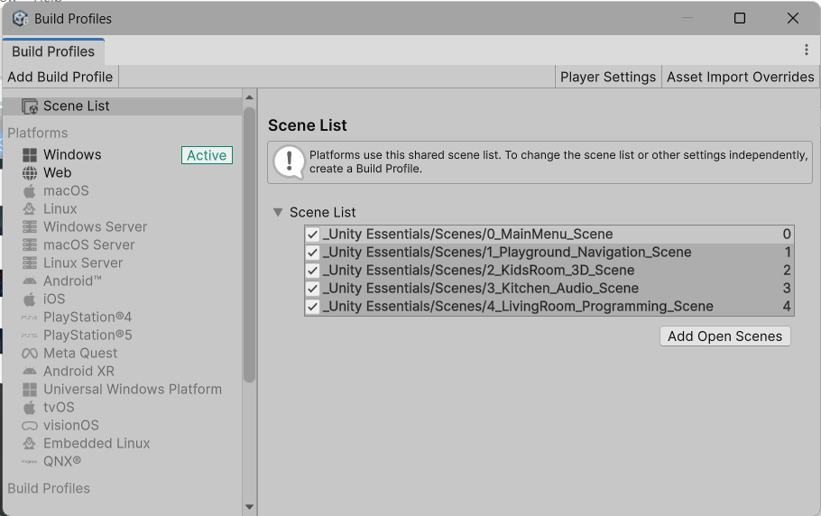

- 플레이어 세팅 작업
    - Company Name, Product Name, Version, Default icon
    - Resolution > windowed, Width, Height 설정


- 메뉴 클릭 신 이동, ESC키로 메뉴 리턴


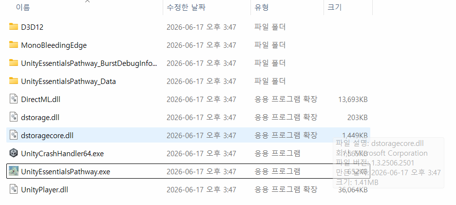

- 유니티 UI Canvase > Button Inspector 속성


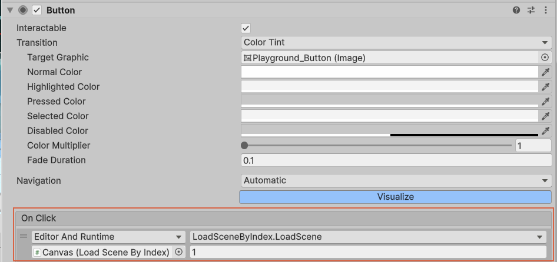
---

### 2.2 3D 모델 불러오기

#### 프로젝트 구분

- 렌더링 파이프라인 종류 3가지 구분

| 종류 | 성능 | 그래픽품질 | 모바일/VR지원 |
|---|---|---|---|
| Built-in | 보통 | 보통 | 보통 |
| URP | 높음 | 높음 | 높음 |
| HDRP | 낮음(고사양) |  |  |

### 2.3 Unity Factory  

- Unity Japan에서 제공하는 무료 HDRP 공장 시뮬레이션 에셋
- 공장건물부터 컨베이어라인, 로봇팔, 작업자, 조명 ...
- https://assetstore.unity.com/ko-KR 에서 `Unity Factory` 검색

#### 프로젝트 생성
- HighDefition 3D(HERP) 프로젝트 생성
- My Assets에서 Unity Factory 검색 후 Import

- Import 후 오류 발생
    - SplineContainer 에러
    - Package Manager > Unity Registry, Splines 검색 후 설치
- Input System 오류
    - 키보드, 마우스 입력 시스템이 Unity 6부터 변경
    - 예전 방식 입력시스템 사용
    - Project Settings > Player > Other Settings > Input Handing, both로 바꾸기

- Global Volume을 오브젝트, 사용체크 비활성화

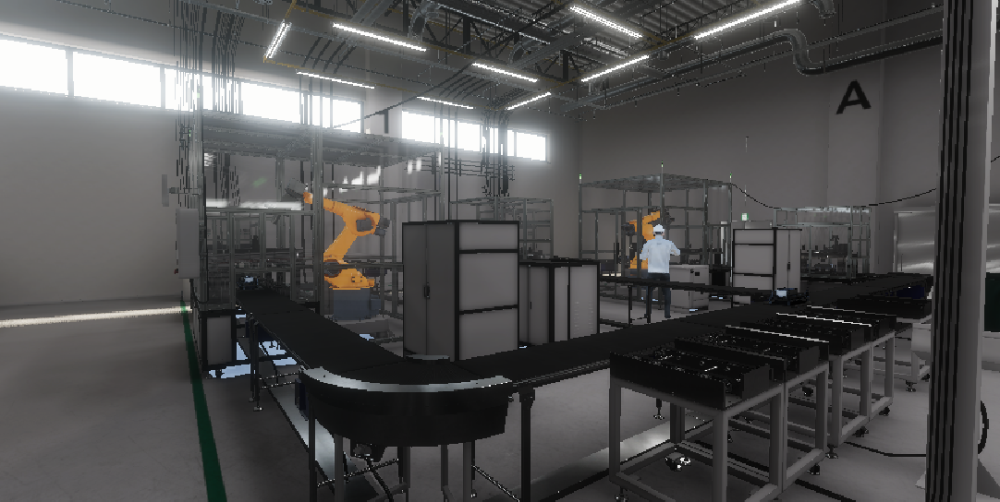

