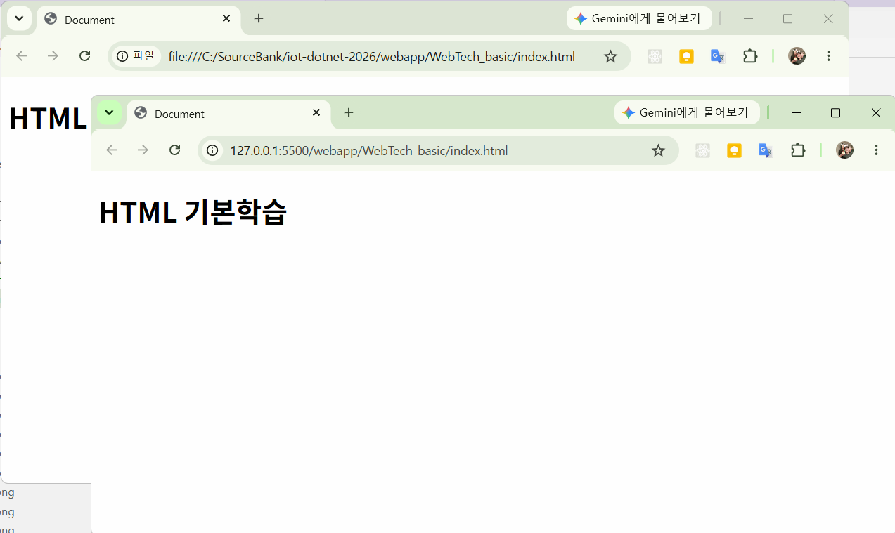
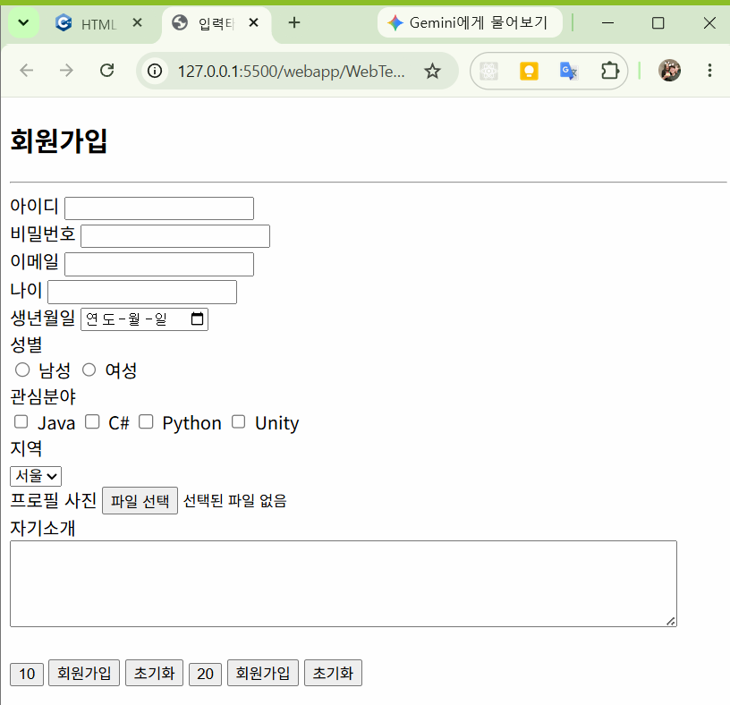
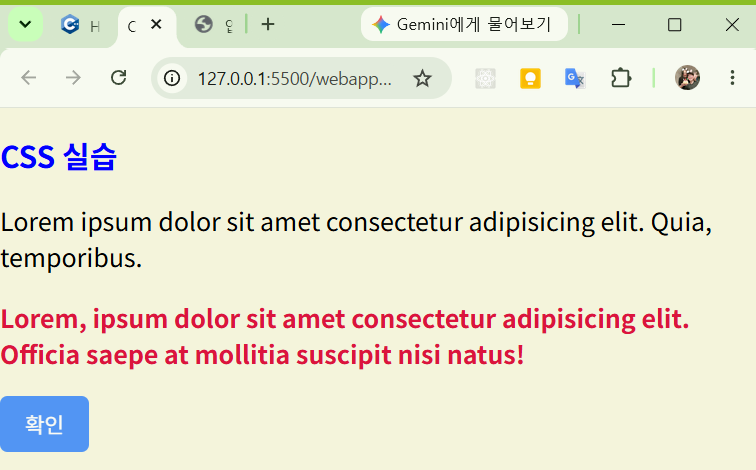
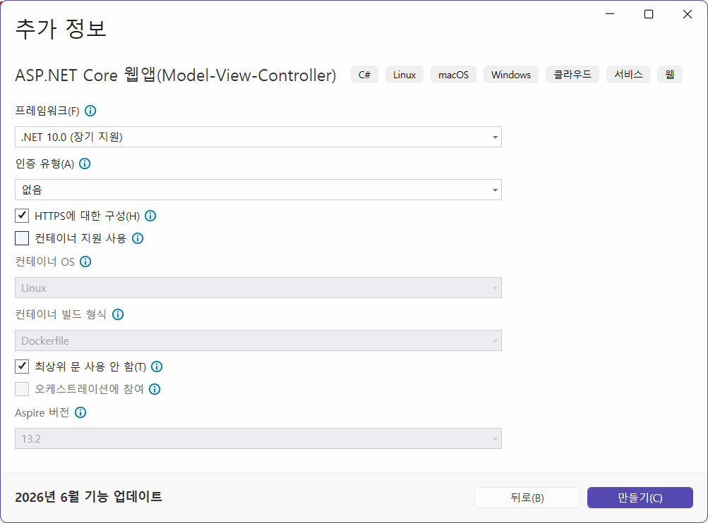
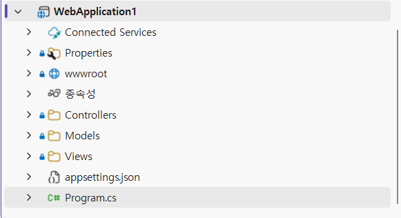
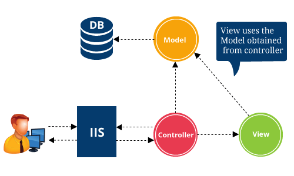

# 2026 닷넷 개발자 비즈니스앱 개발

## 1. 웹 개발 개요

- World Wide Web을 줄여서 부르는 단어
- 인터넷의 목적 : 핵전쟁이 나더라도 데이터를 와전 소실하지 않고 보관하기 ㅜ이해
- 인터넷에서 통신 및 데이터 전달의 어려움 
- 1990년 팀 버너스리가 WWW를 발표. 1980년대부터 연구해온 결과
- XML이 너무 복잡해서 사용이 불편 -> 개량화해서 HTML을 개발
- 2014 이후 `HTML5` 적용중

### 웹 구조
- 프론트엔드 - 웹 기술들을 사용해서 사용자가 브라우저에서 볼 수 있는 눈에 보이는 화면 개발영역
- 백엔드 - 프론트엔드에 전달할 데이터나 동적인 화면을 생성 처리하는 등 눈에 보이지 않는 개발영역

### 웹 기술
- HTML - HyperText Markup Launguage의 약자. 링크로 페이지를 이동하는 기술
- CSS - cascade Style Sheet 약자. HTML에 디자인을 적용시키는 기술
- JavaScript - 원래 HTML(클라이언트, 프론트엔드)에 동작을 지원해주는 기술로 나온 언어.JS로 호칭. 동작
    - JS기술이 진보하여 현재는 서버개발, 앱개발 등 여러방면을 개발하는 언어로 발전

### 백엔드 웹 기술
- 웹 서버(서비스) 단을 개발하는 기술, 프로그래밍 언어별로 구분
- 보통 Server Page라는 용어 사용, JSP(Java Server Page), ASP(Active Server Page)
- Java - Java Bean > EJB > JSP > ASP.NET(윈도우만) > ASP.NET Core(멀티플랫폼)
- Python - Flask(간단한 웹개발), dJango(기업 솔루션), FastAPI(OpenAPI 개발용)

### 웹 서버, 웹 서비스
- 웹 서버 - 프론트엔드 + 백엔드로 사용자가 웹화면을 사용할 수 있도록 서비스
- 웹 서비스 - 백엔드로 데이터만 전달하는 서비스

### 웹을 사용하는 이유
- 설치가 필요없음 - PC 프로그램은 설치파일, 모바일 앱은 앱스토어 설치 필요
    - 웹은 웹브라우저만 있으면 URL로 사용가능
- 운영체제 독립적 - 운영을 하면 OS에 관계없이 사용 가능
    - WPF는 윈도우 종속적
- 업데이트가 쉬움 - 서버만 내용을 업데이트하면 사용자는 기존과 동일하게 사용
- 데이터 공유 - 서버에 존재하는 데이터를 실시간으로 공유가능
    - 데이터포털 OpenAPI, 카카오톡, 네이버 지도, 구글 드라이브...
- AI와 연결 쉬움 - 대부분의 AI서비스가 웹API 형태로 제공


## 2. 웹 표준 기술

### HTML 기본

#### Live Server 설치
- VS Code에서 로컬 HTML 파일을 서버형식으로 보여주는 플러그인
- 확장 > `Live Server` 검색 후 설치
- html > 컨텍스트 메뉴 > Open with Live Server 클릭
- 5500 포트 기본 사용



#### HTML 기본구조

- index.html - 대부분 웹페이지의 첫페이지 파일
- VS Code, html 파일 생성 후 !, tab키로 HTML 기본 코드 생성

```html
<!DOCTYPE html><!-- HTML5 문서 양식 선언 -->
<html lang="en"><!-- 가장 root 태그 -->
<head><!-- 웹페이지 설정구역 -->
    <meta charset="UTF-8"><!-- 페이지 설정, 유니코드 사용 -->
    <!-- Responsive Web 사용. 화면크기에 따라 디자인이 알맞게 변형되는 웹 -->
    <meta name="viewport" content="width=device-width, initial-scale=1.0">
    <title>Document</title>
</head>
<body><!-- 웹 페이지 표현구역 -->
    
</body>
</html><!-- XML과 동일, 모든 태그는 <tag></tag> 로 구성 <tag /> -->
</html>
```

- head - 웹 페이지 설정할 태그 작성
- body - 웹 페이지 표현할 태그 작성

#### HTML 기본 태그

- 마크다운 문법 -> HTML 태그로 변경
- HTML에서는 space는 단일적용, enter는 적용되지 않음

- 파비콘 - 웹브라우저에 표시되는 웹사이트의 아이콘

| 태그 | 설명 |
|:--:|---|
|`<html>`| HTML 문서 시작|
| `<head>` | 문서정보(설정) |
| `<title>` | 브라우저 제목 |
| `<meta>` | 문서 구성정보 |
| `<body>` | 화면에 표시될 내용 |
| `<h1> ~ <h6>` | 제목. 마크다운 #과 동일 |
| `<p>` | 문단 표현 |
| `<a>` | anchor의 prefix. 하이퍼링크. 다른페이지로 이동 |
| `` | 이미지 표현 |
| `<video>` | 동영상 |
| `<source>` | 동영상 위치 태그 |
| `<iframe>` | html 내 다른 html 소스를 추가하는 기능 |
| `<div>` | 영역 구분을 위해 사용. HTML5에서 가장 많이 쓰이는 태그 |
| `<span>` | 인라인 영역 구분. |
| `<ul>` | 순서없는 목록 시작. 마크다운의 `-`와 동일 |
| `<ol>` | 순서있는 목록 시작. 마크다운의 `1.`와 동일 |
| `<li>` | 두 목록의 실제 항목 |
| `<br>` | 줄바꿈 |
| `<hr>` | 가로선 |
| `<table>` | 표(테이블) 시작 태그 |
| `<tr>` | row. 한줄 태그 |
| `<th>` | header. 표 제목 |
| `<td>` | 한 셀 |

- 공백 - `&nbsp;`

- lorem - 화면에 텍스트 꾸미기 작업을 도와주는 스니펫
    - lorem - 임의 표준텍스트 20단어 생성


#### HTML 입력 태그

- HTML에서 사용자 입력을 받기위한 태그

| 태그 | 설명 |
| --- | --- |
| `<form>` | 입력영역 태그 |
| `<label>` | 라벨태그 |
| `<button>` | 버튼 태그 |
| `<textarea>` | 멀티라인 텍스트박스 |
| `<select>` | 콤보박스 시작태그 |
| `<option>` | 콤보박스 아이템 목록 태그 |
| `<input>` | 가장 중요한 입력태그. type 속성으로 여러 컨트롤로 분기 |

- input 타입 목록

| 속성 | 예제 | 설명 |
| --- | --- | --- |
| text | `<input type="text">` | 한줄 텍스트 입력 |
| password | `<input type="password">` | 비밀번호 입력 |
| email | `<input type="email">` | 이메일 입력 |
| number | `<input type="number">` | 숫자 입력 |
| checkbox | `<input type="checkbox">` | 체크박스 |
| radiobox | `<input type="radiobox">` | 라디오박스 |
| file | `<input type="file">` | 파일업로드 |
| date | `<input type="date">` | 날짜 선택 |
| hidden | `<input type="hidden">` | 페이지 내 숨김값 |
| submit | `<input type="submit">` | 등록/저장 버튼 |
| button | `<input type="button">` | 일반 버튼 |
| reset | `<input type="reset">` | 리셋(입력값 초기화) 버튼 |

- input 중 type, submit, button, reset은 button 태그와 동일 
- 웹에서 회원가입, 로그인, 게시판 등록 화면 등에 90%는 위 태그로만 구성



### CSS

#### inputs.html 디자인 바꾸기

- BootStrap - 트위터에서 개발한 UI LIbrary
- 아래 태그를 `<title>` 태그

```html
<link href="https://cdn.jsdelivr.net/npm/bootstrap@5.3.8/dist/css/bootstrap.min.css" rel="stylesheet" integrity="sha384-sRIl4kxILFvY47J16cr9ZwB07vP4J8+LH7qKQnuqkuIAvNWLzeN8tE5YBujZqJLB" crossorigin="anonymous">
```

- 아래 태그를 `</body>` 위에 붙여넣기

```html
<script src="https://cdn.jsdelivr.net/npm/bootstrap@5.3.8/dist/js/bootstrap.bundle.min.js" integrity="sha384-FKyoEForCGlyvwx9Hj09JcYn3nv7wiPVlz7YYwJrWVcXK/BmnVDxM+D2scQbITxI" crossorigin="anonymous"></script>
```

- 각 태그별 class를 적절하게 입력

```html
<!-- class가 CSS를 적용시키는 속성 -->
<input type="text" name="userId" id="userId" class="form-control">
```


- CSS는 HTML에 디자인을 미려하게 변경하는 기술

- [소스](./webapp/WebTech_basic/css_exam.html)



### Javascript

- 웹페이지(HTML)를 동적으로 변경시켜주는 프로그래밍 언어
- 파이썬 학습 난이도와 유사
- Typescript, React, Node.js... 활용되는 곳이 다양

#### HTML 연결

- html에 `<script>` 태그를 사용하여 내부에 같이 표현하거나 외부 js파일을 연결
- 필요한 경우 웹브라우저(Chrome의 경우)


#### 기본문법

- 변수부터 객체까지 - [소스](./webapp/WebTech_basic/js_exam.html)

#### DOM
- Document Object Model 약자. HTML 트리구조를 객체로 만든 모델
- JS로 접근 가능 - [소스](./webapp/WebTech_basic/js_dom.html)


#### JS 결론

- 웹 페이지 동적으로 만들기, HTML 요소 접근 내용 변경 등
- 사용자와 상호작용. 클릭, 드래그 등 이벤트 처리
- DOM 제어
- 서버와 데이터 통신
- 데이터 처리 및 검증. 입력값 검사, 데이터 가공, 계산 등

## 3. ASP.NET Core

### 개요

Microsoft에서 개발한 크로스 플랫폼 웹 개발 프레임워크

#### 특징

- 크로스플랫폼 Windows/Linux/macOS 지원
- ASP.NET에 비해서 속도가 개선됨
- MVC(Model-View-Controller) 패턴 지원(SprngBoot MVC와 동일)
- REST API 개발 가능
- EntityFramework(DB ORM) 기능 지원 - 쿼리문없이 DB핸들링
- Docker, Cloud(Azure) 연동

#### 개발분야

- 홈페이지, 쇼핑몰, ERP/MES/스마트팩토리, 그룸웨어, REST API 서비스, IoT 데이터서버, AI 서버, 게임 서버 등

### 사용법

#### Visual Studio 활용법

1. Visual Studio 오픈
2. 프로젝트 형식, 웹 선택
3. 웹앱 템플릿 중 ASP.NET Core로 시작하는 템플릿 선택



#### ASP.NET Core MVC 패턴 구성



- Connected Service - 외부 클라우드 서비스 연결을 관리(API는 써도 잘 사용하지 않음)
- Properties - 프로젝트 실행 및 빌드 환경 설정
    - launchSettings.hson - 실행  포트, 로그 출력 설정을 관리
- wwwroot - 적적파일(일반 html, css, js, 이미지파일) 프론트엔드 웹용 파일 위치
- 종속성 - 패키지, NuGet 패키지 내부/외부 라이브러리

- 핵심 패턴
    - Controllers - 사용자의 요청(대부분 URL)을 가장 먼저 받아서 처리하는 영역
        - 필요한 데이터는 Models에서, 화면은 Views에서 그려서 전달해주는 역할
    - Models - 데이터 구조 클래스, 비즈니스 로직 등을 정의하고 처리하는 곳
    - Views - 사용자에게 실제로 보여지는 동적 화면(UI) 담당
        - `*.cshtml` - 기본 HTML 소스에 C# 로직이 섞여있는 html파일. `Razor뷰`

- appsettings.json - 애플리케이션 환경 설정. DB연결 문자열, 로깅수준 변경
- Program.cs - 웹앱 시작점(Entry Point)
    - 웹서버 구동에 필요한 서비스 등록, 사용자 요청 라우팅 구성



## 4. 웹 실습 프로젝트

### IoT 스마트홈 통합 플랫폼

- MQTT WPF + Unity + WebAPI 연동

### 공공데이터 통합 플랫폼

- OpenAPI 서비스 + WPF 연동

### 스마트팩토리 MES 미니 플랫폼

### AI 비전 검사 시스템

#### 실시간 채팅 시스템 + 챗봇 기능
