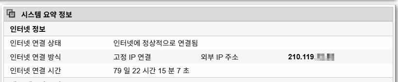
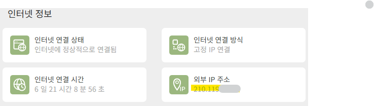
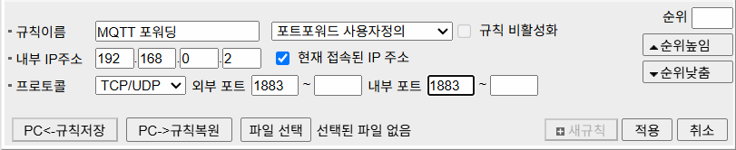
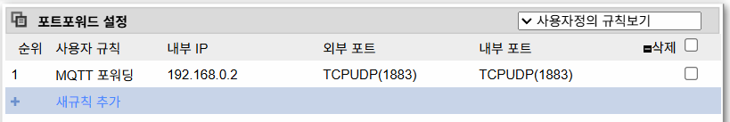
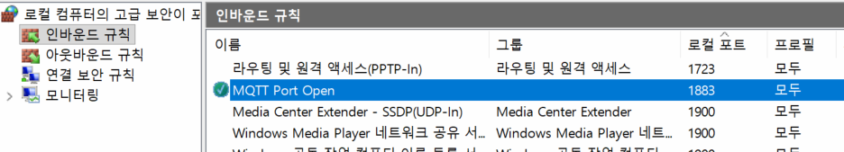
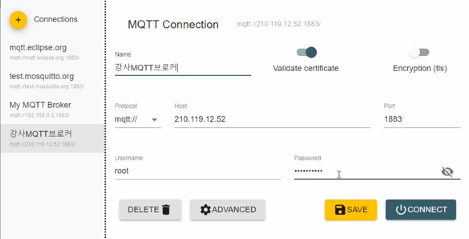
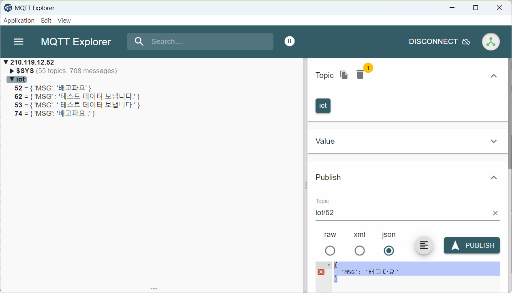

# 2026 닷넷 개발자 토이프로젝트

## 웹 통합 토이 프로젝트

### 공공데이터 통합 플랫폼

- [공공데이터 통합 플랫폼](./TOYPROJECT1.md)

### WPF MVVM 활용

- [MVVM 패턴 학습 + 앱개발](./TOYPROJECT2.md)

### 깃허브 대문 작성

- [GitHub 대문 Readme](./TOYPROJECT3.md)

### AI 비전 검사 시스템

- [Python AI + WebAPI + MQTT 연계](./TOYPROJECT4.md)

### IoT 스마트홈 통합 플랫폼

- MQTT WPF + WebAPI + Unity 연계

### 스마트팩토리 MES 미니 플랫폼

- 컨베이어벨트 조별 + MQTT + Unity 연계

### Unity ProductApp 기능 개선

- 각 상품 클릭시 3D 박스와 연계
- 로봇팔 오브젝트 연계

### 실시간 채팅 시스템 + 챗봇 기능

- Python AI + SignalR API

### 취업처 설명

- 사람인, 잡코리아 확인
    - 분야 입력(임베디드)
    - 신입 선택, 학력 미선택

### 네트워크 연결 설정

- 여러사람이 같이 한 PC(서버) 공유할 수 있도록 공유기/라우터 설정

- 사용중인 공유기 정보 확인

- 현재 포트포워딩 상태

- MQTT 포트포워드 설정 지정

- 이후 설정 저장

- 윈도우 방화벽 포트 연결 허용 설정

- 외부 아이피로 접속 확인

#### MQTT 브로커 접속

- MQTT Explorer에서 Publish 확인