# 웹 통합 토이 프로젝트

## 국가교통정보센터 CCTV 정보 앱 

## 개요

국가교통정보센터에서 제공하는 OpenAPI를 통합해서 운영하는 RESTAPI서비스와 모니터링 앱 통합개발

- 국가교통정보센터 OpenAPI

### 사용기술

- C# 14(.NET 10.0)
- WPF
- OpenAPI 사용 + Wrapping RESTAPI 서비스
- ProgressBar?
- Newtonsoft.json
- ITS 국가교통정보센터 OpenAPI - [링크](https://www.its.go.kr/)
- 경찰청 도시교통정보센터 OpenAP - [링크](https://www.utic.go.kr/)
- MahApps.Metro? - 

### 개발환경 설정

#### 국가교통정보센터 사이트 회원가입

##### 로그인 후 인증키 신청

- 오픈데이터 > 오픈데이터 목록 > CCTV 화상자료
- 인증키 신청 버튼

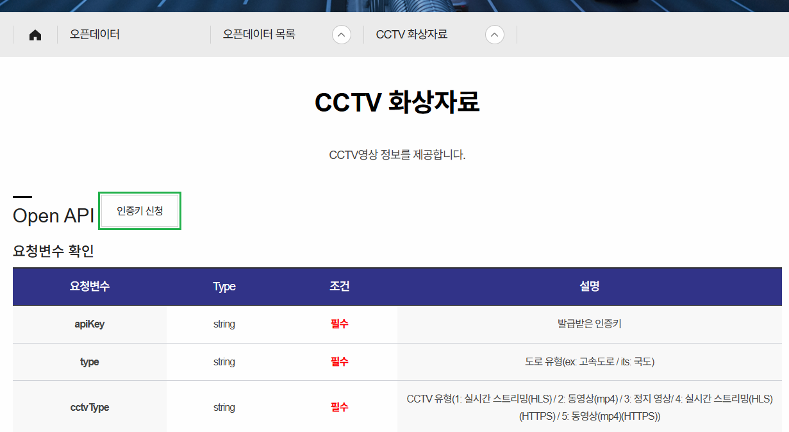

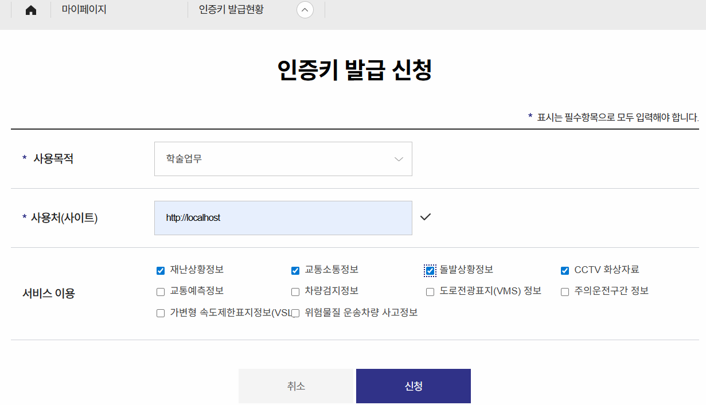

##### 마이페이지 확인

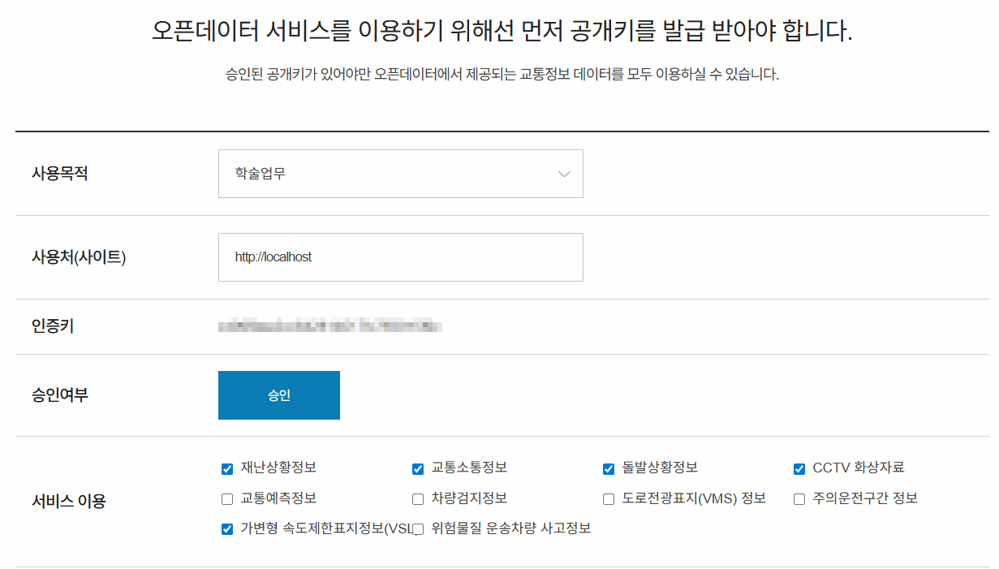

#### Visual Studio

##### WPF 앱 프로젝트 생성

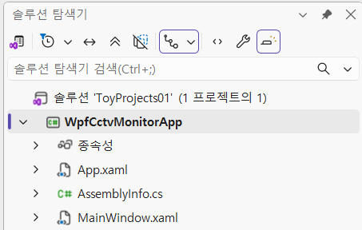

#### 동영상 플레이 라이브러리

- 실시간 스트리밍(HLS), 동영상(mp4) 모두 재생이 가능한 라이브러리 필요
- WPF MediaElement - HLS 재생 어려움, mp4 재생가능, 별도 이미지처리
- WebView2 - HLS 확인필요, mp4 재생가능, 별도 이미지처리
- FFME - HLS, mp4 가능. 이미지 별도
- `LibVLCSharp`.WPF - HLC, mp4 가능. 이미지 별도

##### VLC

VideoLAN Organization에서 제공하는 크로스 플랫폼 멀티미디어 재생툴

스트리밍, 동영상 재생, 이미지 로드 가능

[링크](https://www.videolan.org/)

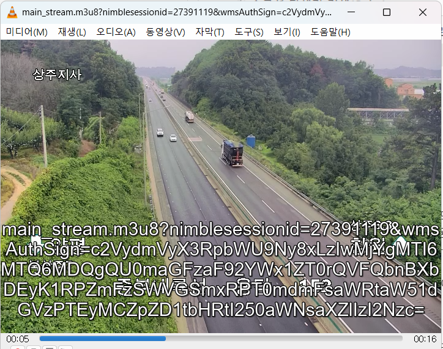

##### NuGet 패키지 설치

- Newtonsoft.Json
- LibVLCSharp.WPF
- VideoLAN.LibVLC.Windows
- WebView2

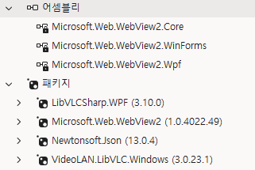

- C, C++로 만들면 어셈블리로 올라감

### 화면 UI

#### 와이어프레임

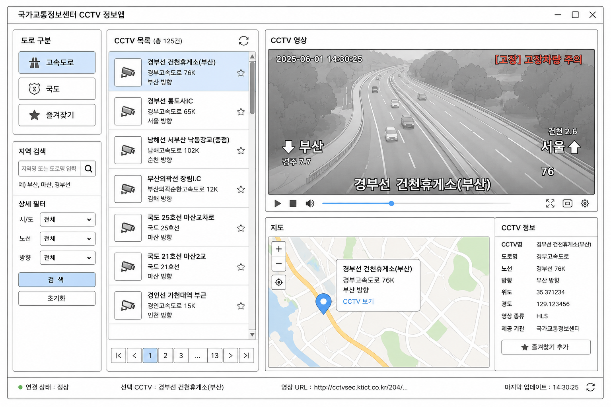

### 기본 구현

#### 메인화면 디자인

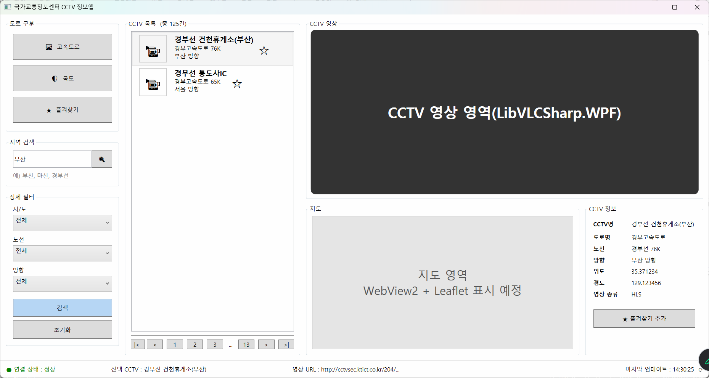

#### 앱 구조 설계

- Common - 공통 함수나 공통 변수 네임스페이스(폴더)
- Model - OpenAPI Json 데이터 구조 모델 클래스 네임스페이스
- Services - OpenAPI 서비스 동작 클래스 네임스페이스

##### 앱 구조별 구현

- Commmon/AppCommon.cs

#### 앱 구조 설계

##### 앱 구조별 구현

- Common/AppCommon.cs - [소스](./toyproject/ToyProjects01/WpfCctvMonitorApp/Common/AppCommon.cs)
- Models/CctvInfo.cs - [소스](./toyproject/ToyProjects01/WpfCctvMonitorApp/Model/CctvInfo.cs)
- Services/ItsCctvService.cs - [소스](./toyproject/ToyProjects01/WpfCctvMonitorApp/Services/ItsCctvService.cs)

##### 화면에 VLC 라이브러리 추가

```xml
<!-- vlc 네임스페이스 추가 -->
<Window x:Class="WpfCctvMonitorApp.MainWindow"
        xmlns="http://schemas.microsoft.com/winfx/2006/xaml/presentation"
        xmlns:x="http://schemas.microsoft.com/winfx/2006/xaml"
        xmlns:d="http://schemas.microsoft.com/expression/blend/2008"
        xmlns:mc="http://schemas.openxmlformats.org/markup-compatibility/2006"
        xmlns:vlc="clr-namespace:LibVLCSharp.WPF;assembly=LibVLCSharp.WPF"
        ... >
```

##### 기본구현

- 로딩 후 스트리밍 테스트


##### 비즈니스 로직에 따라 구현

type `실시간`, 동영상, 정지영상 모두 같은 CCTV를 표현하는 방법만 다름

0. App.config에서 API key 로드
1. 고속도로/국도 선택
2. 지역 검색 - 지역별 최소/최대 위도, 최대/최소 경도 확인
     - 지역 선택으로 간결화
3. 상세필터 - 시/도로 최대/최소 위도와 경도 확인. (노선, 방향은 삭제)
4. 검색 - OpenAPI URL로 위경도 범위별 CCTV 조회
5. CCTV 목록 - 리스트
6. 리스트아이템 클릭 - CCTV 영상 플레이
7. 지도 영역 - CCTV 위치 지도위에 표시
8. CCTV 정보 - json 결과 추출 표시

##### App.config

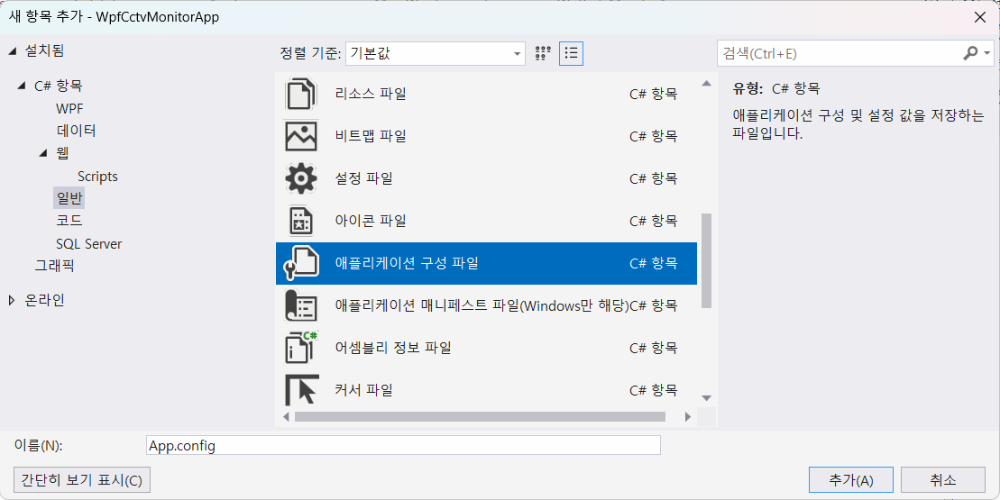

- xml로 구성된 파일
- [소스](./toyproject/ToyProjects01/WpfCctvMonitorApp/App.config)

##### UI 변경

- CCTV목록 페이징 삭제
- 지역 검색 삭제
- 시/도 선택 -> 지역 선택 변경
- 노선, 방향 선택 삭제

##### GeoBound 클래스 생성

- 지역 선택시 최소, 최대 위도/경도를 할당해주는 클래스 - [소스](./toyproject/ToyProjects01/WpfCctvMonitorApp/Common/GeoBound.cs)
- 지역 선택 콤보박스에 로직 추가

##### 검색 버튼 작성

- BtnSearch 명명 및 로직 추가
- ItsCctvService.cs - [소스](./toyproject/ToyProjects01/WpfCctvMonitorApp/Services/ItsCctvService.cs)
- json 매핑 모델 클래스. CctvResponse.cs - [소스](./toyproject/ToyProjects01/WpfCctvMonitorApp/Model/CctvResponse.cs)

##### 중간결과 화면

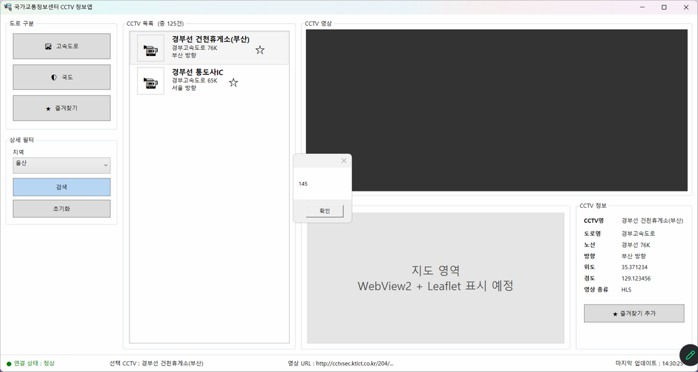

- 도로구분 선택, 지역 선택 후 검색. CCTV 리스트 갯수 출력

##### CCTV 목록아이템 템플릿

- ListBox 일반 ListBoxItem을 ListBox.ItemTemplate으로 변경
- 데이터 바인딩 {Binding CctvName}

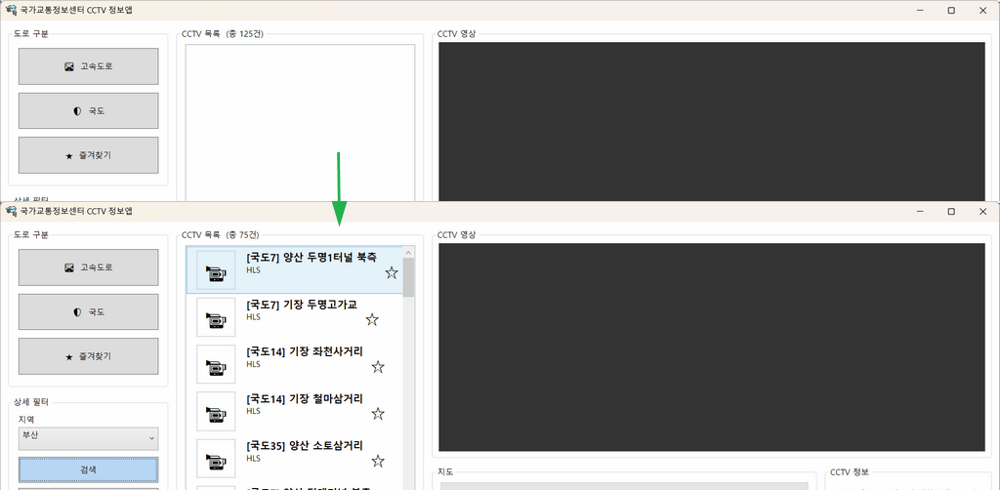

- 국도 선택, 부산 선택 후 검색 결과

##### 리스트뷰 클릭 스트리밍

- 클릭이벤트 생성 메시지창 출력

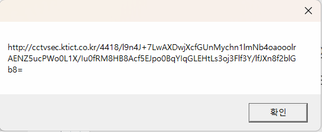

- LibVLCsharp.WPF에 전달 스트리밍 플레이

##### 지도표시

- CefSharp(Chrominum) 웹브라우저는 설치용량이 큼
- WebView2(Edge runtime) 이 상대적으로 용량 적음
- 브라우저 기능 전체 사용이 아인 지도표시만 하면 WebView가 좋음

```xml
<Window x:Class="WpfCctvMonitorApp.MainWindow"
        ...
        xmlns:vlc="clr-namespace:LibVLCSharp.WPF;assembly=LibVLCSharp.WPF"
        xmlns:wv2="clr-namespace:Microsoft.Web.WebView2.Wpf;assembly=Microsoft.Web.WebView2.Wpf"
        ...>
        ...
        <wv2:WebView2 x:Name="WvwMap"/>
        ...
```

- 리스트뷰 상세 미리보기

- 초기화 로직

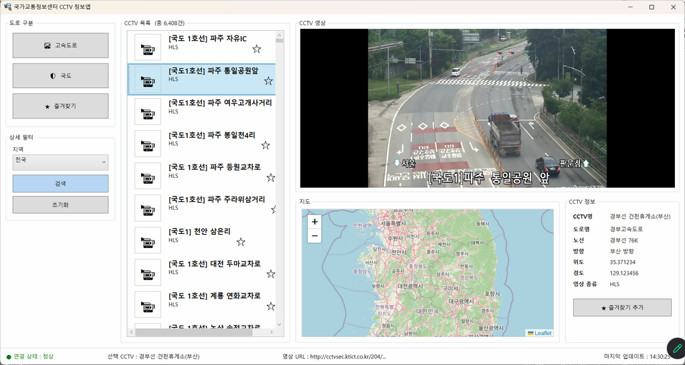

- 리스트뷰 아이템 클릭 시 상세지도 마커표시

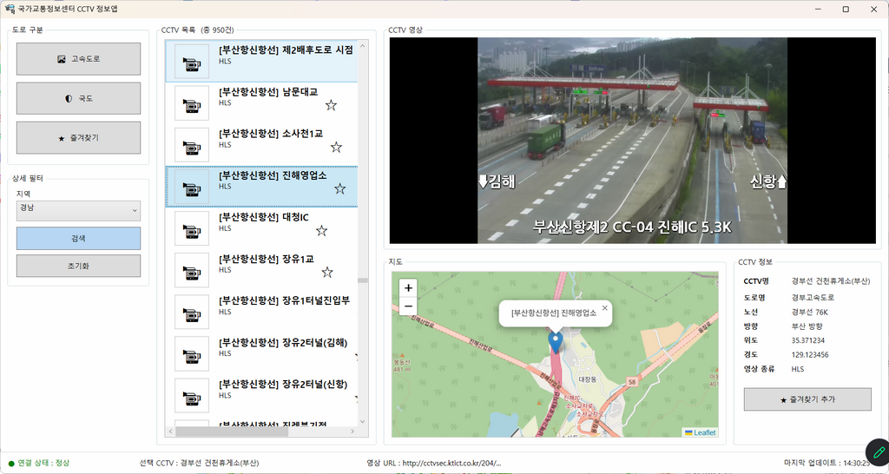

##### CCTV 상세정보

- CctvInfo 내용을 출력
- TextBlock에서 Text 속성에 할당

##### 상태표시줄 작업

- 선택CCTV - CCTVName 그대로 사용
- 영상URL - 전체 표시X, 일부만 표시
- 연결상태 - 리스트박스 아이템 선택 후 스트리밍 상태에 따라 변경
    - `스트리밍 안되는데 Play결과 true (?)`
- 마지막 업데이트 - ?

##### 종료시 메모리 해제

- 메모리 누수 발생 가능성 제거
- OnClosed() 이벤트 객체 해제로직 추가

##### 예외처리

- [x] 지역선택없이 검색하면 프로그램 종료
- [ ] API Key 누락되었을 때
- [ ] VLC 재생 실패 감지

##### 최초 로드시 화면 텍스트 초기화

- CCTV 목록 (총 125건)
- 연결 상태 : 정상
- 선택 CCTV : 경부선 ....
- 영상 URL : ...


##### 리펙토링

- 프로그램 기능은 그대로 유지하면서 내부 구조를 더 좋게 개선
    - 중복코드 제거
    - 메서드 소스를 하위메서드 생성으로 간결화
    - 하드코딩 제거
    - 로직 효율화

- Visual Studio에서 `Ctrl + .` / **Alt + Enter**로 리팩토링을 쉽게 사용

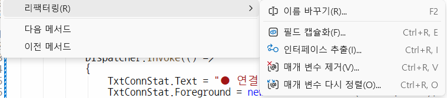


##### 초기화 버튼 기능

- 지역선택 초기화
- 고속도로 기본 토글버튼
- CCTV 목록 제거, 건수 초기화 
- 상태바 초기화
- 영상정지
- 지도 초기화

### UI 변경

- MahApps.Metro 또는 WPF UI
- Light/Dark Theme

#### NuGet Package 설치

- 도구 > NuGet Package 관리자 > 패키지 관리자 콘솔

```powershell
PM> Install-package WPF-UI 
```

- App.xaml 태그 코드 추가
- MainWindow.xaml 부모 클래스 변경
- Light 테마 적용

##### 변환 결과


##### 추가 수정

- 제목표시줄 추가 - WPF UI 특성
- CCTV 정보 글자 잘라서 표기
- 리스트박스 목록 텍스트 정리, 
- 종료 버튼 표시
- 메시지박스 변경


##### 프로그래스바

- 검색 후 리스트박스 항목 다 나오기전까지 표시
- WPF UI 적용 후 반영

##### UI 적용화면

##### 즐겨찾기 DB 추가

##### 즐겨찾기 읽어오기

### OpenAPI 래핑 웹서비스

#### 브릿지 웹서비스 구현

##### ASP.NET Core API 프로젝트

##### WPF 앱 필요 클래스 가져오기

- 네임스페이스 현재이름으로 변경
    - AppCommon.cs 불필요한 속성 제거
    - CctvInfo.cs
    - CctvResponse.cs
    - ItsCctvService.cs 수정

##### Program.cs에 서비스 등록

- ItsCctvService 등록


##### appsettings.json
- Its 서비스키 추가

##### ApiController 추가

- ItsCctvController.cs 클래스 생성

##### 실행결과

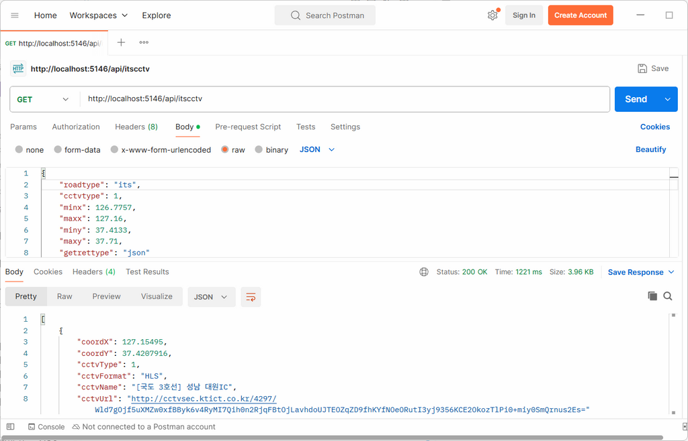

- WPF에서 결과 json 구조 변경

#### 이전 WPF 연계 작업

##### API 웹서비스에 있는 CctvResultDto 가져오기

- WPF로 복사
- 오류나는 부분들 전체 수정

#### 전체 다이어그램

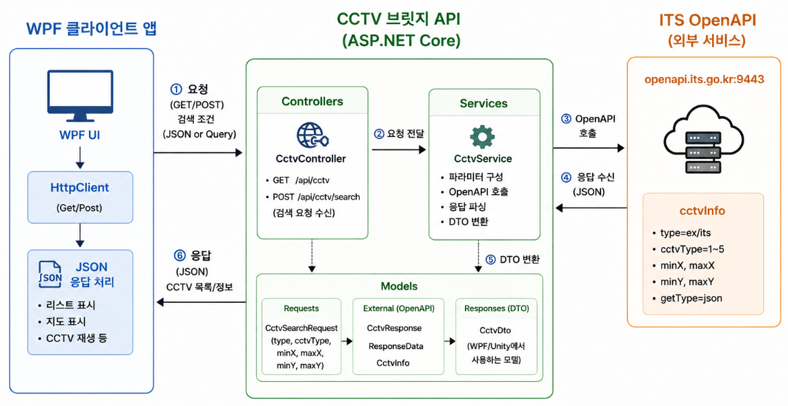

#### 사용기술

|구분|기술|
|---|---|
| 윈앱 UI | WPF(.NET 10) UI Framework|
|통신|HTTP(HTTPS 확장 가능)|
|데이터형식|JSON, 직렬화, 역직렬화|
|브릿지서버 | ASP.NET Core Web API|
|웹서버| Kestrel(크로스플랫폼 웹서버)|
|설정관리| appsettings.json, App.config(XML)|
|서비스호출 | HttpClient |
|외부API | ITS 국가교통정보센터 OpenAPI |
|API방식 | REST API|
|웹아키텍처 | Model-service-Controller Layer|