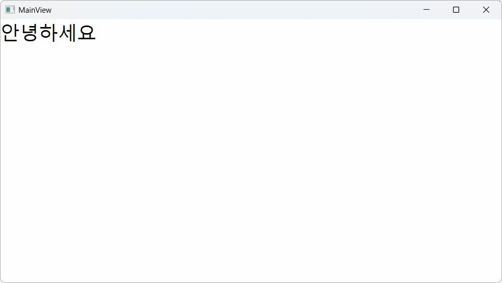
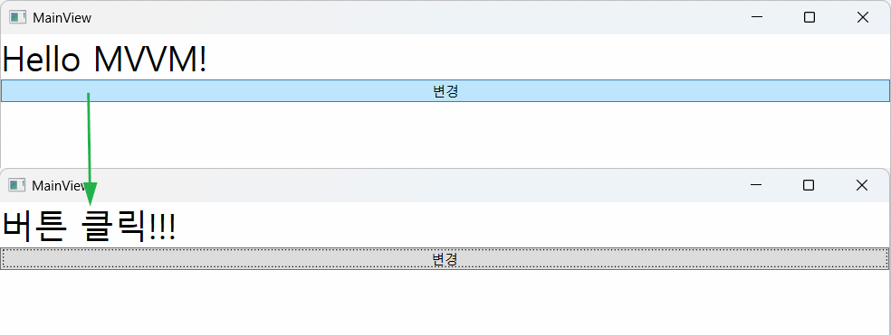
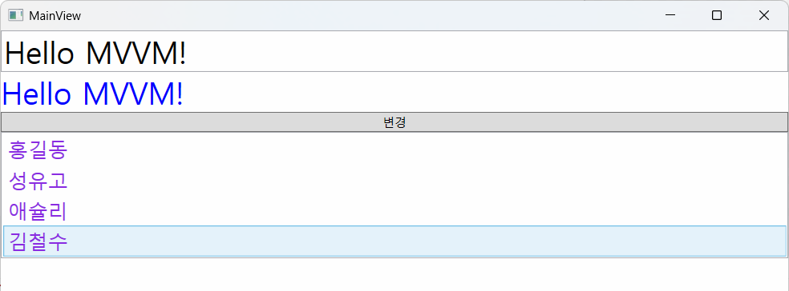
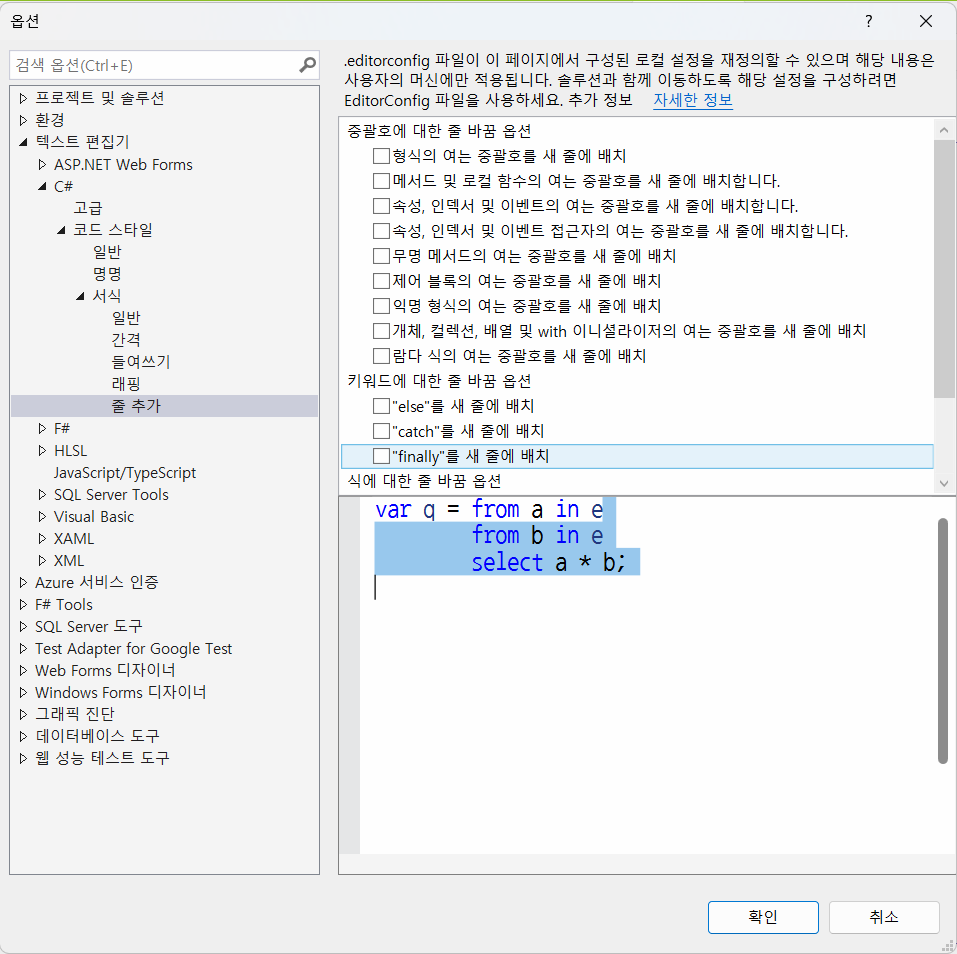

# 토이 프로젝트

## WPF MVVM 패턴 활용

### MVVM 패턴 개요

- MVC 패턴의 확장
    - C++, C#, Winforms 예전 MVC 따로 사용
    - 웹쪽에서는 MVC 패턴을 많이 씀
    - 장점
        - 팀으로 개발 시 유리
        - 디자인 작업과 개발 작업을 분리하여 공백을 줄일 수 있음
        - 유지보수 시 구분된 레이어만 수정
    - 단점
        - 단일 개발보다 구현이 쉽지 않음

- MVVM - Model - View - ViewModel
    - MVC 패턴과의 차이점 - Controller 대신인 ViewModel이 아니라 `View`가 대문
    - View에서 동작의 처리를 시작, **이벤트 핸들러가 모두 사라짐**
    - View에 해당하는 xaml.cs 파일에는 아무런 로직이 안들어감(디자이너가 로직을 생각하지 말것)
    - 버튼, 키보드 이벤트가 모두 ViewModel로 넘어감 -> Command
    - 단점
        - 디버깅이 어려움(몇몇 상태는 디버깅이 안됨)


- MVVM 라이브러리 - 손쉽게 MVVM 구현을 도와주는 역할
    - `CommunityToolkit.Mvvm` - MS개발. 가장 일반적. 난이도 하
    - Prism - MS관련 개발. 중대형 비즈니스용. 난이도 상
    - Caliburn.Micro - 간단한 MVVM 패키지. 난이도 하
    - Avalonia - 크로스플랫폼용 MVVM. 난이도 중


### MVVM 초간단 예제

- CommunityToolkit.Mvvm 패키지 설치
- Models, Views, ViewModels 폴더(네임스페이스) 생성

#### Model 작성

```cs
namespace WpfMvvm01.Models {
    public class Person {
        public string Name { get; set; }
    }
}
```
#### View 작성

```cs
namespace WpfMvvm01.Views {
    /// <summary>
    /// MainView.xaml에 대한 상호 작용 논리
    /// </summary>
    public partial class MainView : Window {
        public MainView()
        {
            InitializeComponent();
        }
    }
}
```

#### ViewModel 작성

```cs
using CommunityToolkit.Mvvm.ComponentModel;
namespace WpfMvvm01.ViewModels {
    public partial class MainViewModel : ObservableObject {
        [ObservableProperty]
        private string message = "안녕하세요";
    }
}
```

#### View 생성

- Views/MainView.xaml 생성

#### App.xaml 수정

- StartupUri - MainWindow.xaml -> /Views/MainView.xaml로 변경(단순 변경)
- App.xaml.cs 생성자 추가

```cs
public App()
{
    MainView view = new MainView();
    // MainView 객체의 전체데이터를 관장하는 DataContext에 ViewModel을 할당
    view.DataContext = new MainViewModel();
    view.Show();
}
```

#### MainView.xaml 수정

```xml
<TextBox FontSize="30" Text="{Binding Message}"/>
```

- INotifyPropertyChanged 인터페이스 내 PropertyChanged 이벤트가 실행

#### 실행 결과



#### ViewModel에 버튼클릭 로직 추가

- MVVM은 Click 이벤트 사용 안함. 대신 Command 사용

```cs
[RelayCommand] 
private void ChangeMessage()
{
    Message = "버튼 클릭!!!!!";
}
```

#### View에 버튼 추가

- ViewModel의 RelayCommand 메서드명 + Command 입력 필수

```xml
<Button Content="변경" Command="{Binding ChangeMessageCommand}>
```

#### 결론



- View는 디자이너 작업 - UI 설계서에 따라 속성값만 Binding으로 입력
- ViewModel은 개발자 작업 - 속성은 ObservableProperty로 명령은 메서드(Command 제거)로 작성

#### 양방향 바인딩

- View에서 입력한 데이터를 ViewModel을 통해 Model로 전달하기 위해서 사용



```xml
<TextBox FontSize="30" Text="{Binding Message,UpdateSourceTrigger=PropertyChanged}"/>
<TextBlock FontSize="30" Foreground="Blue" Text="{Binding Message}"/>
```

#### ListView 데이터 바인딩

- ViewModel에 ObservableCollection 사용

```cs
public ObservableCollection<Person> People { get; } =
[
    new Person {Name = "홍길동"},
    new Person {Name = "성유고"},
    new Person {Name = "애슐리"},
    new Person {Name = "김철수"}
];
```

- View에 ListView 컨트롤 추가

```xml
<ListView ItemsSource="{Binding People}" SelectedItem="{Binding SelectedPerson}">
    <ListView.ItemTemplate>
        <DataTemplate>
            <TextBlock Text="{Binding Name}" FontSize="20" Foreground="BlueViolet"/>
        </DataTemplate>
    </ListView.ItemTemplate>
</ListView>
```

```cs
[ObservableProperty]
private Person? selectedPerson;
```

- ViewModel에 선택항목 표시 속성

```xml
<TextBlock FontSize="20" Foreground="CadetBlue" Text="{Binding SelectedPerson.Name}"/>
```


- 실행화면


### 책 대여 시스템 MVVM

#### 필요 패키지

- CommunityToolkit.Mvvm
- MahApps.Metro
- MahApps.Metro.IconPacks
- MySQLConnector
- NLog...


#### 패턴 폴더 생성

- Models, Views, ViewModels


### C# 줄바꿈 설정



- Ctrl + k + e

#### MVVM 패턴에서 다이얼로그 처리

- MVVM 패턴에서 MahApps.Metro의
    - this.ShowMessageAsync() 메서드 사용 불가
- MVVM 패턴에 맞춰서 설정

- Main

```xml
<mah:MetroWindow x:Class="WpfMvvm02.Views.MainView"
        ...
        Title="{Binding Title}" Height="550" Width="1000"
        mah:DialogParticipation.Register="{Binding}">
```