# 토이 프로젝트

출처 : 자바 스프링부트 프로젝트와 파이썬 AI 프로젝트 연결하기(허진경 / 부크크)로 학습

## AI 비전검사 시스템


### Python WebAPI 서비스

- Python 웹 라이브러리/프레임워크
    - 오픈소스이기에 라이브러리 프레임워크가 엄청 많음
    - Flask - 가볍고 필요한 기능만 제공하는 소규모 프로젝트용 웹
    - `FastAPI` - REST API에 최적화 된 웹. 매우 빠름, 난이도 중
    - Django - 모든 기능을 제공하는 대형 프레임워크.
    - Pyramid - 중대형 프로젝트용 프레임워크. 난이도 상
    - Falcon - REST API 전용
    - Bottle - 초경량, 난이도 하

- 웹 서버(실행 서버)
    - `Uvicorn` - FastAPI 실행 서버

#### 파이썬 가상환경 설치

- 프로젝트 경로까지 폴더 이동

```bash
> python -m venv .venv
```

- 가상환경 실행
```bash
.\.venv\Scripts\activate.ps1
```

- .gitignore에 python 관련 설정 추가

#### 기본 패키지 설치

```bash
> pip install fastapi uvicorn
```

#### FastAPI 기본

- [](./toyproject/ToyProjects04/pythonAi/main01.py)

- 서버실행 1

```powershell
> fastapi dev main01.py
```

- `서버실행 2`

```powershell
> uvicorn main01:app --reload [--port 8000]
```

- 실행화면

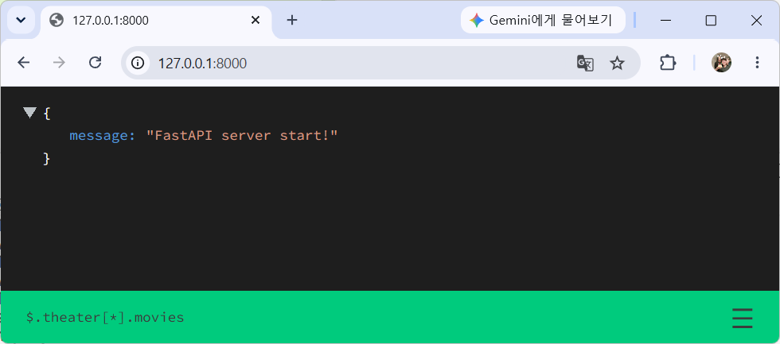

#### FastAPI docs

- Swagger UI - PostMan과 동일한 기능을 하는 웹페이지
- http://127.0.0.1:8000/docs

#### Get API

- Get method : [소스](./toyproject/ToyProjects04/pythonAi/main02.py)

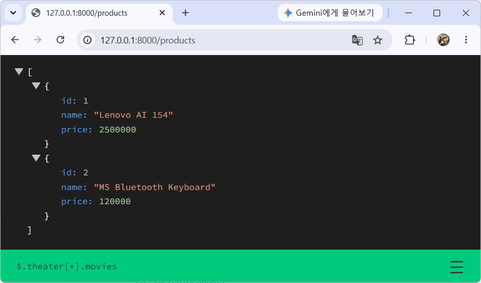

#### FastAPI 디버그 모드

- 아래 코드 추가 후 디버깅 시작으로 실행
- 디버깅 가능

```py
if __name__ == '__main__':
    uvicorn.run('main02:app', host='127.0.0.1', port=8000, reload=True)
```

#### 쿼리스트링

- URL 뒤 ?변수명=값&변수명=값 : [소스](./toyproject/ToyProjects04/pythonAi/main03.py  )


#### Pydantic 모델 사용

- POST 요청으로 JSON을 데이터를 받을때 사용하는 모델 패키지. C# Newtonsoft.Json과 동일한 역할 : [소스](./toyproject/ToyProjects04/pythonAi/main04.py)

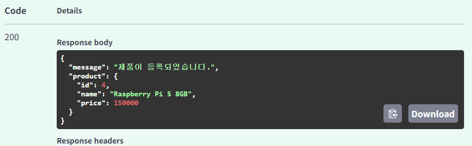

- 데이터 입력시 Validation 체크 

```json
{
  "id": 4,
  "name": "Test",
  "price": 1000
}
```

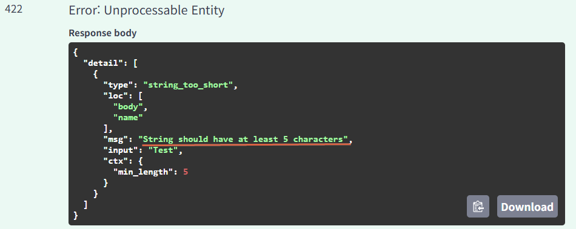

- products 배열(리스트)에 제품 등록

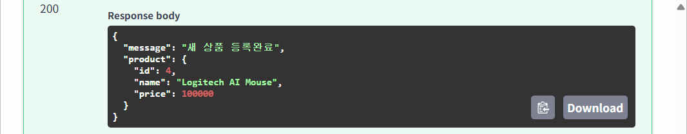

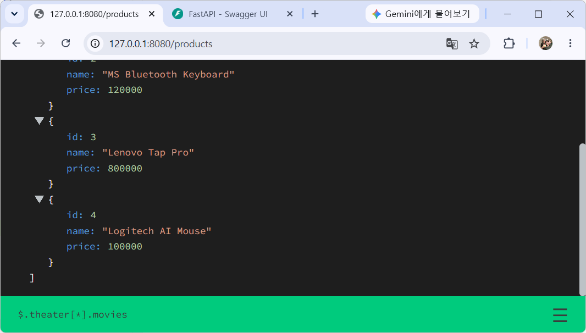

#### Put/Delete 메서드 처리 API

- 나중에...

### Python AI 물체인식

- OpenCV + PyTorch + YOLO

```powershell
(venv) PS > pip install opencv-python
(venv) PS > nvidia-smi
----------------------------------------+
...              CUDA Version: 13.1     |
-----------------+----------------------+

(venv) PS > pip install torch torchvision --index-url https://download.pytorch.org/whl/cu130
(venv) PS > pip install ultralytics
(venv) PS > pip install python-multipart
```

#### 기본 API 서비스 

- 비전용 FastAPI 서비스 - [소스](./toyproject/ToyProjects04/pythonAi/main05.py)

#### 기본 이미지 출력

```python
@app.get('/')
async def root():
    image = Image.open('./test01.png')  # PILLOW 패키지로 이미지오픈 메모리업로드

    return FileResponse('./test01.png', media_type='image/png')
```

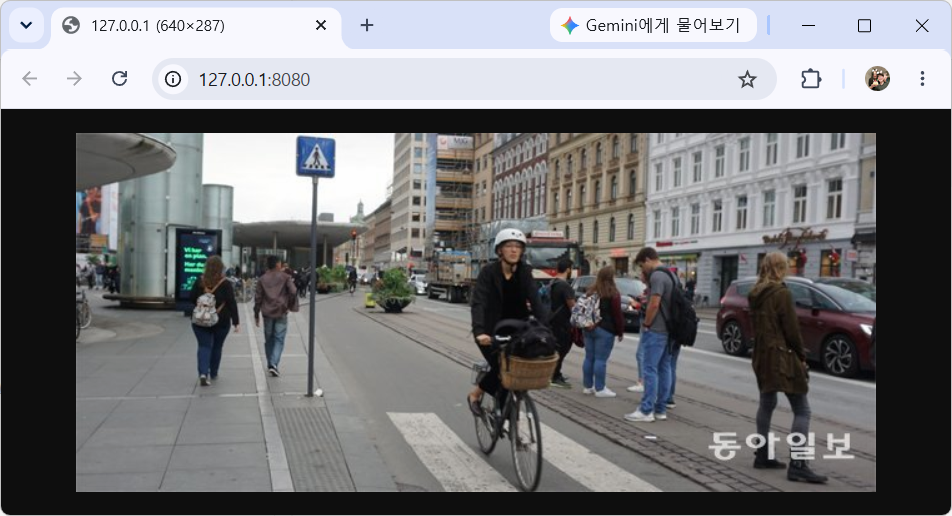

#### Pillow 오픈 뒤 전송

```python
@app.get('/')
async def root():
    image = Image.open('./test01.png')  # PILLOW 패키지로 이미지오픈 메모리 업

    buffer = BytesIO()
    image.save(buffer, format='PNG')
    buffer.seek(0)

    return StreamingResponse(buffer, media_type='image/png')
```

#### YOLO 물체인식

- detectObjects() : [소스](./toyproject/ToyProjects04/pythonAi/main05.py)

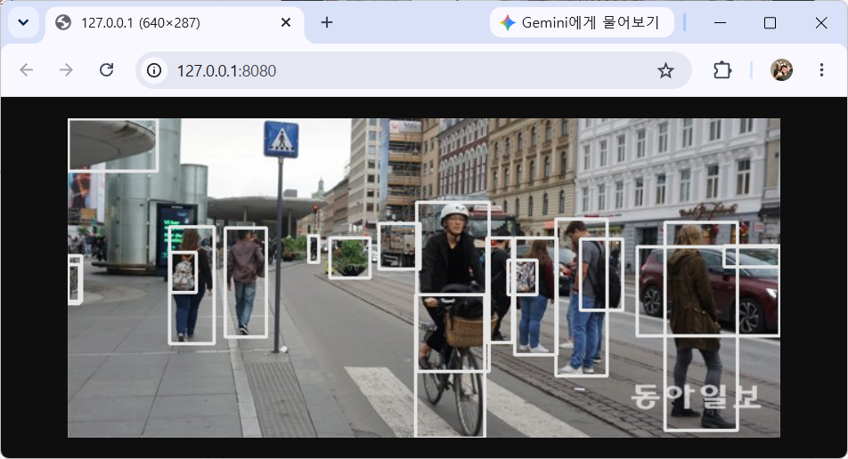

- 신뢰도 표시

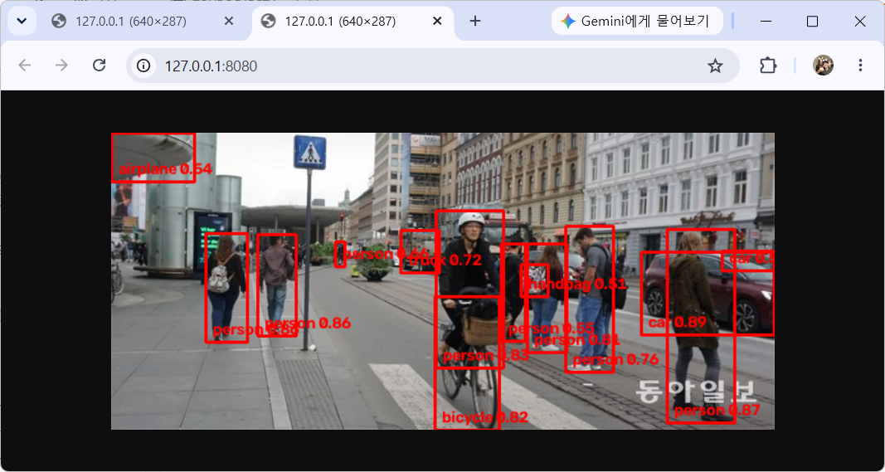

#### 결과이미지 타서버 요청및 인식결과 응답

- Post 함수 : [소스](./toyproject/ToyProjects04/pythonAi/main05.py)
- 타 서버에서 이미지 객체 인식을 요청해서, 인식된 결과를 돌려주는 작업

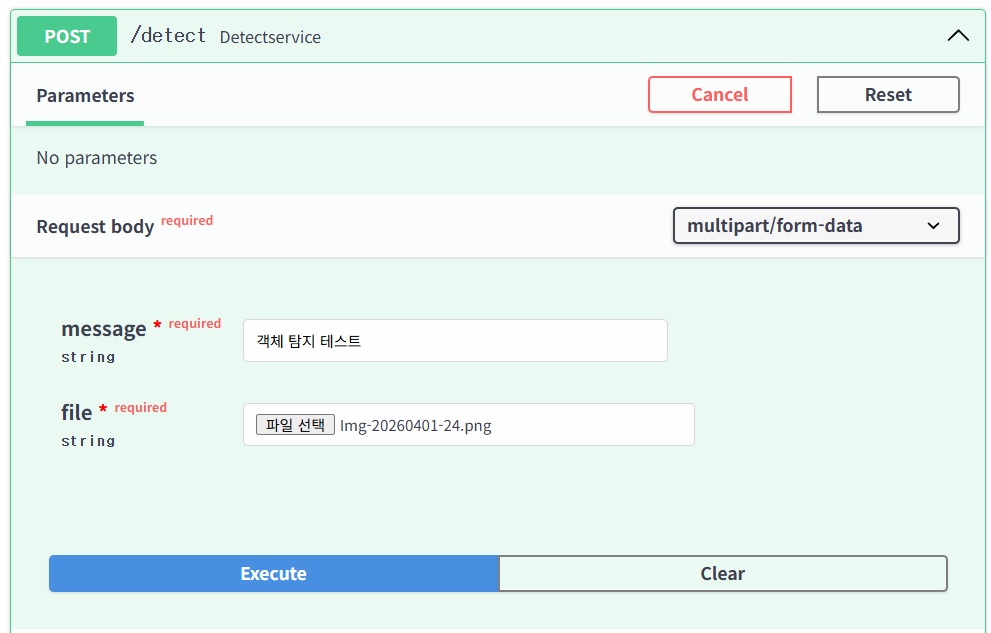

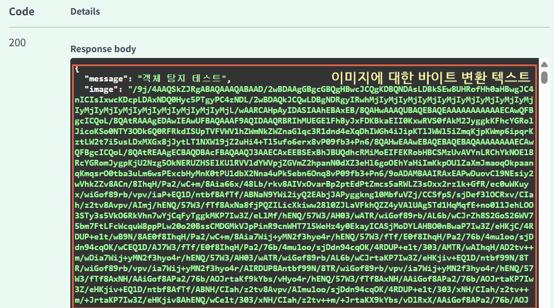

### ASP.NET Core WebSite

- 백엔드 RestAPI형태 + 프론트엔드 일반 HTML 
    - 프론트엔드 React, WPF 등 확장 가능

- ASP.NET Core웹앱(MVC) 프로젝트 생성
    - Model, Views 폴더 삭제
    - wwwroot 아래 폴더 모두 삭제
    
- Program.cs 수정

- NetServiceController.cs 추가 - [소스](./toyproject/ToyProjects04/BackendCs/ResponseAiServer/Controllers/NetServiceController.cs)

- index.html 작성 - [소스](./toyproject/ToyProjects04/BackendCs/ResponseAiServer/wwwroot/index.html)

- 실행 결과

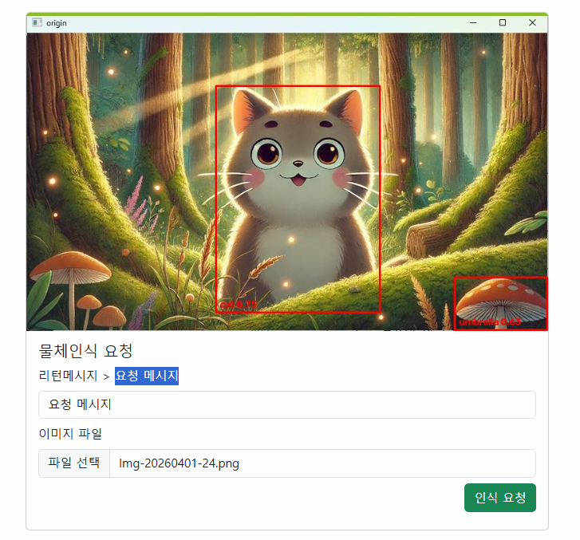


### 동영상, 웹캠 실시간 객체인식

- MQTT(WebSocket) 사용해서 동영상 전달

```powershell
(venv) PS > pip install paho-mqtt
```

- 웹서비스 불필요

- 동영상 물체인식 - [소스](./toyproject/ToyProjects04/pythonAi/main06.py)

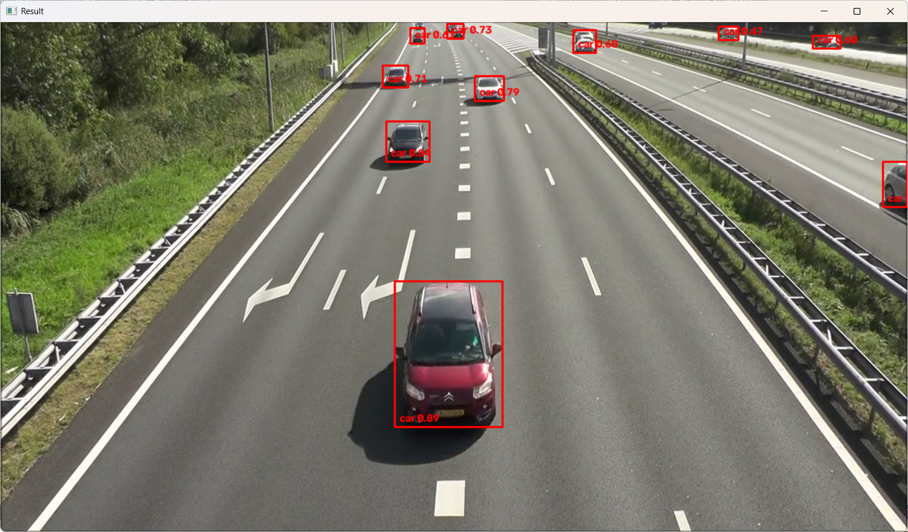

#### MQTT 전송

- MQTT 브로커 설정 수정 - WebSocket 사용을 위한 설정 추가
- 윈도우 서비스(services.msc)에서 mosquitto brocker실행 중지
- mosquitto.conf 파일 수정

```conf
# 기본 MQTT 설정 - 그대로 사용
listener 1883
protocol mqtt

# WebSocket 설정 - 스트리밍용 추기
listener 9001
protocol websocket
```

|포트|프로토콜|주사용처|
|--|--|--|
|1883|MQTT|Pythonm ESP32, RasberryPi 등|
|9001|WebSocket|Javascript, Unity WebGL, Streaming|

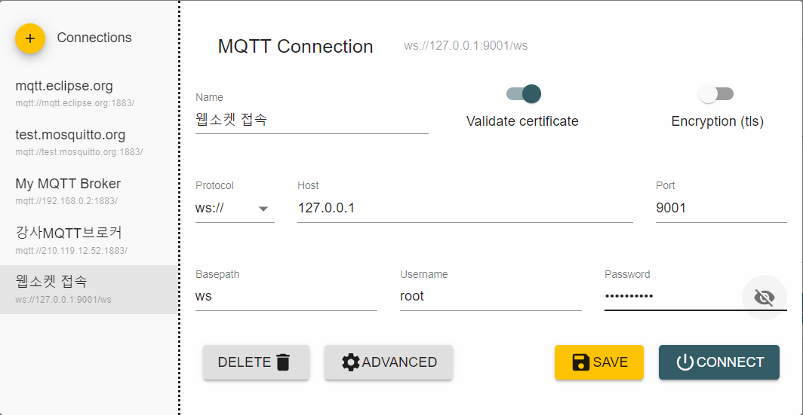

- 데이터 전달확인

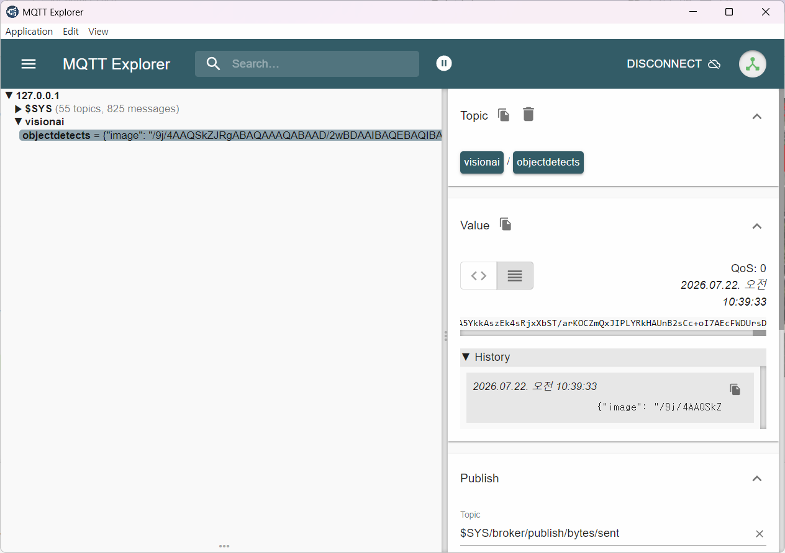

- ASP.NET 웹페이지 객체인식결과 스트리밍

동영상 업로드

- 클래스별로 색상다르게 표시

```python
### 색상설정 함수
def getColors(num_colors):
    np.random.seed(42)
    colors = [tuple(np.random.randint(0,255,3).tolist()) for _ in range(num_colors)]

    return colors

# 색상표
class_names = model.names   # YOLOv8m 대략 80개
num_classes = len(class_names)
colors = getColors(num_classes)

# 클래스별로 색상 변경
cv2.rectangle(image, (x1,y1), (x2,y2), colors[int(class_id)], thickness=2)
cv2.putText(image, f'{label} {conf:.2f}', (x1+7, y2-7), 
            cv2.FONT_HERSHEY_SIMPLEX, 0.5, colors[int(class_id)], 2)
```

- 실시간 물체인식

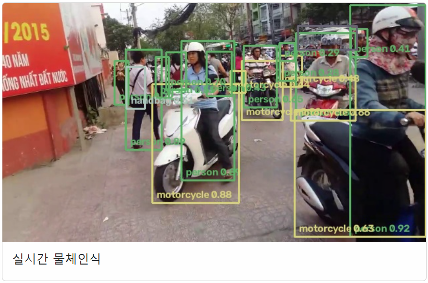

### 비전 검사 토이프로젝트

- 현재까지
    - 웹 이미지 객체 탐지
    - 웹캠/동영상 객체 탐지
    - 사람 모자이크 처리

- 난이도 하
    - 탐지된 객체수 집계
    - 진행방향별 차량 통과수 집계
    - 반려동물 감지 시스템

- 난이도 중
    - 사람 출입 카운터
    - 진행방향별 차량 통행량 분석
    - 주차장 차량관리
    - 침입 감지 시스템
    - 장기 체류자 감지
    - 쓰러짐 감지

- 난이도 상
    - 안전모 착용 감지
    - 운전중 졸음 감지
    - 불량품 검출
    - 제품 수량 검사, 포장 누락 검사
    - 공정 위치 이탈 감지
    - `화재/연기 감지`
    - 위험구역 접근 감지
    - 공장 라인 생산량 집계
    - AI 스마트 경광등, 도어, 쓰레기통, 농장 동물 감지
    
### 화재/연기 감지 알람시스템

- Python에서 진행한 화재/연기 감지 소스 활용
- firedetect-11s.pt 사전학습 모델 활용


